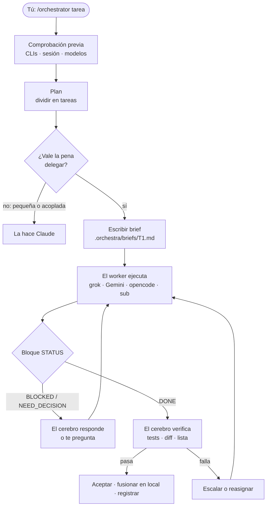
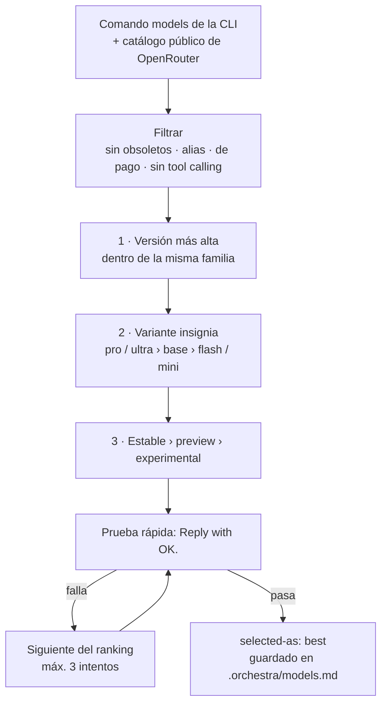

<p align="center">
  
</p>

<p align="center">
  <a href="#-funciones">Funciones</a> ·
  <a href="#-cómo-funciona">Cómo funciona</a> ·
  <a href="#-instalación">Instalación</a> ·
  <a href="#-uso">Uso</a> ·
  <a href="#-seguridad">Seguridad</a> ·
  <a href="#-solución-de-problemas">Problemas</a>
</p>

<p align="center">
  
  
  
  
  
</p>

<p align="center">
  <a href="README.md">English</a> · <a href="README.zh-CN.md">简体中文</a> · <b>Español</b>
</p>

---

**OrkestraKu** es una *skill* de [Claude Code](https://claude.com/claude-code) que convierte tu sesión de Claude en el **director** de una pequeña orquesta de IA. Escribes `/orchestrator <tarea>`; Claude planifica el trabajo, separa las partes independientes, entrega cada una al *worker* que mejor encaja y **verifica cada resultado por sí mismo** antes de aceptarlo.

Los workers son las herramientas de IA de línea de comandos que ya tienes: **grok**, **Gemini** (Antigravity CLI `agy`), **opencode** y los propios **subagentes** de Claude. Claude los llama directamente desde la shell: sin puente MCP, sin paquete envoltorio y sin servidor que mantener. Todo el proyecto es un único archivo `SKILL.md`.

> *Orkestra* significa orquesta en indonesio; *-Ku* significa "mío". Tu propia orquesta de workers de IA.

---

## ✨ Funciones

| | Función | Detalles |
|:-:|---|---|
| 🧠 | **Claude sigue siendo el cerebro** | Planifica, decide, supervisa y verifica. Los workers hacen el trabajo pesado; nada se acepta solo por la palabra de un worker. |
| 🎯 | **El worker adecuado para cada tarea** | Investigación web → grok, documentos largos → Gemini, ediciones mecánicas → opencode, código crítico → subagente de Claude. |
| 🏆 | **El modelo más nuevo, elegido en vivo** | Cada sesión reconstruye el catálogo con el comando `models` de cada CLI, lo ordena y hace una prueba rápida al ganador. Nunca usa nombres de modelos obsoletos. |
| 🎚️ | **Esfuerzo por tarea** | Bajo para renombrar, medio para el trabajo normal, alto para arquitectura y revisión final. Se traduce a los niveles reales de cada CLI. |
| 🆓 | **Modelos gratuitos primero en opencode** | Solo modelos `:free` de OpenRouter o modelos gratuitos de OpenCode Zen. Los modelos de pago son un límite estricto. |
| 🛡️ | **Solo lectura por defecto** | La investigación corre sin autoaprobación. Los cambios de archivos solo ocurren en un *git worktree* dedicado y se revisan y fusionan localmente. |
| 🔁 | **Escalado y respaldo** | Límite de uso → siguiente modelo. Falla dos veces → nivel o esfuerzo más alto. Sigue fallando → otro worker, o lo hace Claude. |
| 🕹️ | **Supervisado o automático** | El modo supervisado pregunta antes de lanzar y ante dudas de alcance. El automático va de principio a fin con presupuesto y límites estrictos. |
| 📒 | **Aprende de su registro** | Cada ejecución queda registrada. Los workers que necesitan rehacer trabajo con frecuencia se descartan la próxima vez. |

---

## 🧭 Cómo funciona



Una tarea solo se delega cuando se cumplen **las tres** condiciones: es independiente, se puede explicar en cinco frases y su resultado se puede comprobar con un test, un comando o una lista breve. Todo lo que lleve menos de ~15 minutos, Claude lo hace directamente.

### Quién toca qué

| Worker | CLI | Ideal para | Modelo por defecto (oct. 2026) |
|---|---|---|---|
| 🌐 **grok** | `grok` | Investigación web y en X, actualidad, segundas opiniones | `grok-4.7` |
| 📚 **Gemini** | `agy` | Repos grandes, documentos largos, resúmenes, borradores de docs | `gemini-3.8-flash-high` |
| 🔧 **opencode** | `opencode` | Código repetitivo, renombrados, tests simples, formato | el mejor modelo gratuito disponible |
| 🧩 **subagente** | integrado en Claude Code | Código crítico, arquitectura, revisión de código | `fable`, si no `opus` |

La columna de modelos es solo una foto del momento. La skill nunca usa una lista fija: vuelve a leer el catálogo de cada CLI en cada sesión.

### Cómo se elige el modelo



---

## 🚀 Instalación

Necesitas **[Claude Code](https://claude.com/claude-code)**. Las CLIs de los workers son opcionales: las que falten se omiten, y sin ninguna la skill sigue funcionando con subagentes de Claude.

**Windows: PowerShell**

```powershell
irm https://raw.githubusercontent.com/yoelkh/orkestraku/main/install.ps1 | iex
```

**Windows: Símbolo del sistema (cmd)**

```bat
powershell -NoProfile -ExecutionPolicy Bypass -Command "irm https://raw.githubusercontent.com/yoelkh/orkestraku/main/install.ps1 | iex"
```

**macOS / Linux / Git Bash**

```bash
curl -fsSL https://raw.githubusercontent.com/yoelkh/orkestraku/main/install.sh | sh
```

El instalador copia `SKILL.md` a `~/.claude/skills/orchestrator/`, guarda una copia de seguridad si había una versión distinta y luego muestra los workers que encontró:

```text
  OrkestraKu  /orchestrator skill for Claude Code

  [OK] Installed C:\Users\you\.claude\skills\orchestrator\SKILL.md

  Workers
  [OK] grok      grok 1.0.50 (c58f321264ba) [stable]
  [OK] agy       1.3.2
  [OK] opencode  1.18.35
  [OK] sub       Claude subagents (always available inside Claude Code)
```

<details>
<summary><b>Más opciones: por proyecto, versión concreta, desinstalar, instalación manual</b></summary>

| Qué | PowerShell | macOS / Linux |
|---|---|---|
| Instalar solo para el proyecto actual (`./.claude/skills`) | `& ([scriptblock]::Create((irm https://raw.githubusercontent.com/yoelkh/orkestraku/main/install.ps1))) -Scope project` | `curl -fsSL …/install.sh \| sh -s -- --project` |
| Instalar una etiqueta o rama | `… -Ref v1.0.0` | `… \| sh -s -- --ref v1.0.0` |
| Actualizar | vuelve a ejecutar el comando de instalación | vuelve a ejecutar el comando de instalación |
| Desinstalar | `& ([scriptblock]::Create((irm https://raw.githubusercontent.com/yoelkh/orkestraku/main/install.ps1))) -Uninstall` | `curl -fsSL …/install.sh \| sh -s -- --uninstall` |

**Manual:** descarga [`skills/orchestrator/SKILL.md`](skills/orchestrator/SKILL.md) y guárdalo como `~/.claude/skills/orchestrator/SKILL.md`.

</details>

### Preparar los workers (opcional)

| Worker | Instalar | Iniciar sesión (lo haces tú, nunca la skill) |
|---|---|---|
| grok | [x.ai](https://x.ai) | `grok login` |
| Gemini | Antigravity CLI (`agy`) | inicia sesión en la primera ejecución |
| opencode | `npm i -g opencode-ai` | `opencode auth login` (clave de OpenRouter opcional) |
| subagente | integrado | nada que hacer |

---

## 🪄 Uso

En Claude Code:

```text
/orchestrator [workers=<lista>] [tier=best|fast|standard|strong] [effort=auto|low|medium|high] [mode=supervised|auto] <tarea>
```

| Ejemplo | Qué ocurre |
|---|---|
| `/orchestrator compara los 3 frameworks web de Rust más populares para una API pequeña` | Investigación en paralelo por los workers más adecuados; Claude sintetiza y verifica los datos. |
| `/orchestrator workers=grok,sub resume las noticias de esta semana sobre WebGPU y revisa qué le falta a nuestro renderer` | Solo participan grok y los subagentes. |
| `/orchestrator workers=gemini:pro,opencode tier=fast añade tests unitarios a src/utils` | Gemini fijado a su familia Pro; modelos más baratos en el resto. |
| `/orchestrator mode=auto renombra la API Logger a Telemetry en todo el repo` | Se ejecuta de principio a fin sin preguntar, dentro de git worktrees y de su presupuesto. |
| `/orchestrator workers=ask …` | Te deja marcar workers y modelos en una lista. |

Puedes ajustarlo a mitad de sesión con lenguaje natural, en cualquier idioma: *"T2 con gemini pro"*, *"todo en fast"*, *"sube el esfuerzo"*, *"pasa a auto"*.

### Modos

| | **supervised** (por defecto) | **auto** |
|---|---|---|
| Antes de lanzar | Muestra una tabla `tarea · worker · modelo · nivel · esfuerzo · perfil` y espera tu visto bueno | Empieza de inmediato |
| Si un worker pregunta | Alcance o arquitectura → te pregunta. Técnico → responde él | Responde él, elige la opción más reversible y registra la decisión |
| Escalado | Pregunta antes | Automático |
| Presupuesto | ninguno | máx. 10 delegaciones, 2 reanudaciones cada una |
| Límites estrictos | siempre | siempre |

---

## 🔒 Seguridad

**Dos perfiles de permisos.** Claude elige uno por tarea:

| Worker | Perfil READ (investigación, revisión) | Perfil WRITE (solo en git worktree) |
|---|---|---|
| grok | sin opción de aprobación · los intentos de escritura se cancelan | `--always-approve` |
| Gemini (`agy`) | `--mode plan`* | `--mode accept-edits` |
| opencode | `--agent plan` | `--auto` |
| subagente | brief de solo lectura | su propio worktree |

\* Comprobado durante el desarrollo: si el ajuste global de agy `toolPermission` es `always-proceed`, el modo plan **sigue escribiendo archivos**. La skill lee ese ajuste en la comprobación previa y, si está activo, ejecuta las tareas de lectura de agy solo sobre una copia temporal o en un worktree. Después de cada ejecución READ, el cerebro también comprueba que ningún archivo del proyecto haya cambiado.

**Límites estrictos** que nunca son automáticos, en ningún modo: hacer *push* a un remoto, tocar `main`/`master`, borrar archivos fuera de `.orchestra/`, cualquier cosa que salga de tu máquina, gastar dinero (incluidos modelos de pago), secretos y archivos `.env`, instalar paquetes globalmente o iniciar sesión en CLIs, y cualquier cosa que git no pueda deshacer.

**Nunca se usan:** `agy --dangerously-skip-permissions`, `grok --yolo` ni un ajuste global de autoaprobación. Los briefs nunca contienen secretos ni documentos de clientes.

---

## 📂 Qué crea

Todo va en `.orchestra/` dentro de tu proyecto (se añade a `.gitignore` automáticamente si el proyecto usa git):

```text
.orchestra/
├── models.md           # catálogo de modelos del día, ranking y pruebas rápidas
├── orchestra-log.md    # una línea por tarea delegada: worker, modelo, esfuerzo, resultado
├── briefs/T1.md        # lo que se le pidió a cada worker
├── runs/T1.out|.err    # salida en bruto del worker
├── runs/index.md       # tarea → worker, modelo, ID de sesión, hora de inicio
└── wt/T1/              # git worktree para tareas WRITE (se elimina tras fusionar)
```

Pregunta *"¿vale la pena orquestar?"* o *"¿qué modelo funciona mejor para tests?"* y Claude responde a partir de `orchestra-log.md`, no de suposiciones.

---

## 🩺 Solución de problemas

| Síntoma | Causa y solución |
|---|---|
| `opencode` falla con *"not a valid application for this OS"* o *"postinstall script was not run"* | npm omitió el postinstall de opencode. Ejecuta `cd "$env:APPDATA\npm\node_modules\opencode-ai"; node postinstall.mjs`. |
| Los modelos gratuitos de OpenRouter fallan con *"guardrail restrictions and data policy"* | Tu configuración de privacidad de OpenRouter bloquea los modelos gratuitos. Permítelo en [openrouter.ai/settings/privacy](https://openrouter.ai/settings/privacy) o deja que la skill use los modelos gratuitos de OpenCode Zen. |
| grok dice que no has iniciado sesión | Ejecuta `grok login` tú mismo. La skill nunca inicia sesión por ti. |
| Gemini escribe archivos en una tarea de solo lectura | `toolPermission: "always-proceed"` en `~/.gemini/antigravity-cli/settings.json`. Ver [Seguridad](#-seguridad). |
| El worker recibe un brief sin comillas (Windows) | Windows PowerShell 5.1 elimina las `"` de los argumentos nativos. La skill pasa los briefs mediante archivos (`--prompt-file` o un prompt de una línea que apunta al archivo), nunca como argumentos directos. |
| Claude pide permiso antes de cada comando de worker | Es el modo de permisos de Claude Code, no de esta skill. Añade reglas de permiso en la configuración de Claude Code si quieres menos avisos. |

---

## 🧪 Probado en

Validado el 10 de octubre de 2026 en Windows 11 con PowerShell 5.1:

| Comprobación | Resultado |
|---|---|
| grok 1.0.50 · `grok-4.7` | ✅ prueba rápida 5 s · en READ lee archivos y busca en la web · escrituras canceladas |
| agy 1.3.2 · `gemini-3.8-flash-high` | ✅ prueba rápida ~50 s · ⚠️ el modo plan escribe si `always-proceed` está activo |
| opencode 1.18.35 · `opencode/nemotron-3-ultra-free` | ✅ prueba rápida 24 s · `--agent plan` bloquea escrituras |
| Subagente de Claude · `fable` | ✅ |
| Briefs con `"comillas"`, `&`, `\|`, `>` | ✅ llegan intactos mediante archivos en las tres CLIs |
| `install.ps1` e `install.sh` | ✅ instalar · ya actualizado · copia de seguridad · rechazar archivo inválido · desinstalar |

---

## 📄 Licencia

[MIT](LICENSE) © 2026 yoelkh
