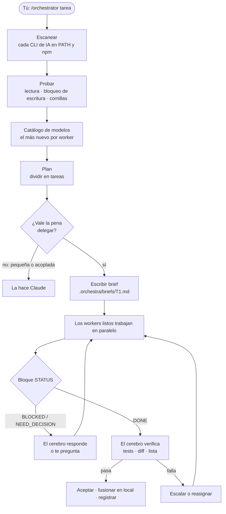
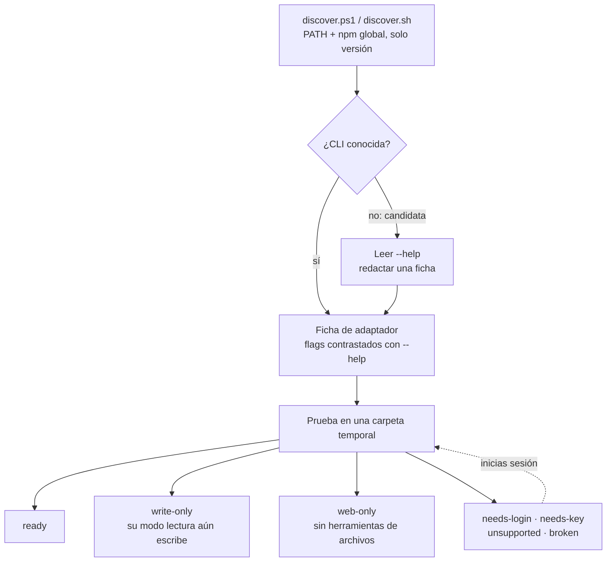
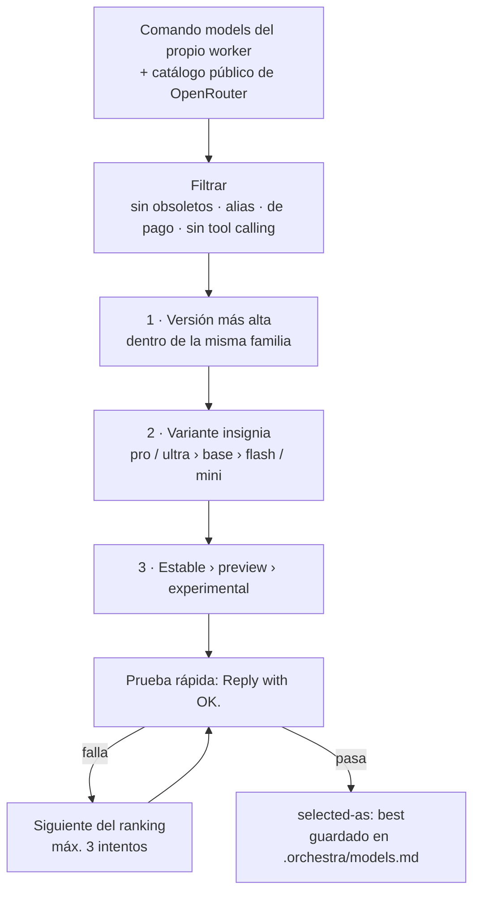

<p align="center">
  
</p>

<p align="center">
  <a href="#-funciones">Funciones</a> ·
  <a href="#-cómo-funciona">Cómo funciona</a> ·
  <a href="#-descubrimiento-de-workers">Descubrimiento</a> ·
  <a href="#-instalación">Instalación</a> ·
  <a href="#-uso">Uso</a> ·
  <a href="#-seguridad">Seguridad</a> ·
  <a href="#-solución-de-problemas">Problemas</a>
</p>

<p align="center">
  
  
  
  
  
  
</p>

<p align="center">
  <a href="README.md">English</a> · <a href="README.zh-CN.md">简体中文</a> · <b>Español</b>
</p>

---

**OrkestraKu** es una *skill* de [Claude Code](https://claude.com/claude-code) que convierte tu sesión de Claude en el **director** de una orquesta de IA. Escribes `/orchestrator <tarea>`; Claude planifica el trabajo, separa las partes independientes, entrega cada una al *worker* que mejor encaja y **verifica cada resultado por sí mismo** antes de aceptarlo.

Los workers son **las herramientas de IA de línea de comandos que tengas instaladas**. OrkestraKu examina tu equipo, reconoce por nombre 43 CLIs de IA (grok, Antigravity/Gemini, opencode, Qwen Code, Kimi Code, MiMo, Hermes, Codex, Aider, Crush y más), detecta otras desconocidas entre tus paquetes globales de npm y **prueba cada una** antes de confiar en ella. Los **subagentes** de Claude siempre forman parte de la orquesta. Claude llama a los workers directamente desde la shell: sin puente MCP, sin paquete envoltorio y sin servidor.

> *Orkestra* significa orquesta en indonesio; *-Ku* significa "mío". Tu propia orquesta de workers de IA.

---

## ✨ Funciones

| | Función | Detalles |
|:-:|---|---|
| 🔎 | **Encuentra cada CLI de IA que tienes** | Un escáner de solo lectura busca en tu PATH 43 CLIs de IA conocidas y, en tus paquetes globales de npm, otras desconocidas. Solo ejecuta comandos de versión. |
| 🧪 | **Prueba antes de confiar** | Cada CLI pasa una prueba "tres en uno" en una carpeta temporal: ¿puede leer un archivo?, ¿su modo de solo lectura bloquea de verdad la escritura?, ¿llegan intactas las comillas? |
| 🏷️ | **Sabe por qué una CLI está inactiva** | Cada fallo se clasifica (`needs-login`, `needs-key`, `unsupported`, `broken`…) junto con el paso exacto para activarla. |
| 🗂️ | **Recuerda entre proyectos** | Los resultados se guardan por versión de cada CLI, así que las pruebas lentas o de pago no se repiten. Las CLIs inactivas se revisan en cada sesión: en cuanto inicias sesión, se usan. |
| 🧠 | **Claude sigue siendo el cerebro** | Planifica, decide, supervisa y verifica. Nada se acepta solo por la palabra de un worker. |
| 🎯 | **Aprovecha toda la orquesta** | Asigna por capacidad (búsqueda web, contexto largo, modelos gratuitos, razonamiento más fuerte), reparte las tareas paralelas entre workers y puede pedir a un panel de varios proveedores una segunda opinión. |
| 🏆 | **El modelo más nuevo, elegido en vivo** | Cada sesión reconstruye el catálogo de cada worker con su propio comando `models`, lo ordena y hace una prueba rápida al ganador. |
| 🎚️ | **Esfuerzo por tarea** | Bajo para renombrar, medio para el trabajo normal, alto para arquitectura y revisión final, según los niveles reales de cada CLI. |
| 🆓 | **Modelos gratuitos donde se paga por token** | Solo modelos `:free` de OpenRouter o gratuitos de OpenCode Zen. Los modelos de pago y los proveedores medidos son un límite estricto. |
| 🛡️ | **Solo lectura por defecto** | La investigación corre sin autoaprobación. Los cambios de archivos solo ocurren en un *git worktree* dedicado y se revisan antes de fusionarlos en local. |
| 🔁 | **Escalado y respaldo** | Límite de uso → siguiente modelo. Falla dos veces → nivel o esfuerzo más alto. Sigue fallando → un worker de otro proveedor, o Claude mismo. |
| 📒 | **Aprende de su registro** | Cada ejecución queda registrada; los workers que suelen necesitar rehacer trabajo se descartan. |

---

## 🧭 Cómo funciona



Una tarea solo se delega cuando se cumplen **las tres** condiciones: es independiente, se puede explicar en cinco frases y su resultado se puede comprobar con un test, un comando o una lista breve. Todo lo que lleve menos de ~15 minutos, Claude lo hace directamente.

---

## 🔍 Descubrimiento de workers

Ejecuta `/orchestrator scan` para verlo por separado. El escaneo es rápido y gratuito; la prueba se hace una vez por versión de cada CLI y se guarda en `~/.claude/orchestra/workers-cache.md`.



| Estado | Qué significa | Cómo se usa |
|---|---|---|
| ✅ `ready` | Pasó todas las pruebas | Cualquier tarea que encaje con sus puntos fuertes |
| 🟨 `write-only` | Funciona, pero su modo de solo lectura escribió un archivo (o no tiene) | Solo dentro de un git worktree o sobre una copia temporal |
| 🌐 `web-only` | Solo es segura sin herramientas de archivos ni shell | Investigación web |
| 🔑 `needs-login` / `needs-key` | Instalada, sin sesión iniciada o sin proveedor configurado | Inactiva; Claude te da el comando exacto |
| ⛔ `unsupported` | El proveedor terminó el plan del que depende el cliente | Inactiva, con el motivo |
| 🧩 `broken` | No arranca | Inactiva, con la solución |
| 🚫 `excluded` | El propio Claude Code, o una pasarela que puede enviar mensajes a personas | Nunca es worker salvo que tú lo actives |

**Cualquier otra CLI.** Si el escaneo encuentra una CLI de IA sin ficha, Claude lee su `--help`, redacta un adaptador (flag no interactivo, flag de modelo, modo de solo lectura, salida JSON) y ejecuta la misma prueba. Solo se usa si la pasa, y los flags que aprueban todo (`--yolo`, `--dangerously-*`, `bypass…`) nunca se usan.

### Quién toca qué

La asignación es por capacidad, así que una CLI recién activada se une a la orquesta de inmediato.

| Tipo de trabajo | Necesita | Lo más habitual |
|---|---|---|
| Investigación web y en X, actualidad | búsqueda web | grok · hermes (`web-only`) |
| Repos grandes, documentos largos, resúmenes | contexto largo | agy (Gemini) · mimo / kimi cuando estén listas |
| Código repetitivo, renombrados, tests simples | barato o gratis, edita archivos | opencode (modelos gratuitos) · qwen / kimi cuando estén listas |
| Código crítico, arquitectura, revisión | el razonamiento más fuerte | subagente de Claude |
| Segunda opinión | otra familia de proveedor distinta a la del autor | cualquier worker listo de otro proveedor |

Las tareas independientes se reparten entre workers (máx. 2 por worker y 5 en total) en lugar de hacer cola en uno solo. Para investigación o revisión de alto riesgo, Claude puede enviar el mismo brief de solo lectura a un **panel** de 2–3 workers de proveedores distintos y comprobar cada punto en el que discrepen.

### Cómo se elige el modelo



---

## 🚀 Instalación

Necesitas **[Claude Code](https://claude.com/claude-code)**. Las CLIs de los workers son opcionales: sin ninguna, la skill sigue funcionando con subagentes de Claude.

**Windows: PowerShell**

```powershell
irm https://raw.githubusercontent.com/yoelkh/orkestraku/main/install.ps1 | iex
```

**Windows: Símbolo del sistema (cmd)**

```bat
powershell -NoProfile -ExecutionPolicy Bypass -Command "irm https://raw.githubusercontent.com/yoelkh/orkestraku/main/install.ps1 | iex"
```

**macOS / Linux / Git Bash**

```bash
curl -fsSL https://raw.githubusercontent.com/yoelkh/orkestraku/main/install.sh | sh
```

El instalador copia la skill a `~/.claude/skills/orchestrator/`, guarda en `~/.claude/orchestra/backups/` cualquier archivo que reemplace y luego busca CLIs de IA:

```text
  OrkestraKu  /orchestrator skill for Claude Code

  [OK] Installed C:\Users\you\.claude\skills\orchestrator  (4 new, 0 updated, 0 unchanged)

  AI CLIs found on this machine
  [OK] grok         agent     grok 1.0.50 (c58f321264ba) [stable]
  [OK] agy          agent     1.3.2
  [OK] opencode     agent     1.18.35
  [OK] qwen         agent     0.21.8
  [OK] kimi         agent     0.18.0
  [OK] hermes       agent     Hermes Agent v0.19.1 (2026.7.30)
  [--] claude       brain     2.1.269 (Claude Code)  (not used as a worker)
  [OK] sub          agent     Claude subagents (always available)
```

"Encontrada" no es lo mismo que "lista": ejecuta `/orchestrator scan` en Claude Code para probarlas.

<details>
<summary><b>Más opciones: por proyecto, versión concreta, desinstalar, instalación manual</b></summary>

| Qué | PowerShell | macOS / Linux |
|---|---|---|
| Instalar solo para el proyecto actual (`./.claude/skills`) | `& ([scriptblock]::Create((irm https://raw.githubusercontent.com/yoelkh/orkestraku/main/install.ps1))) -Scope project` | `curl -fsSL …/install.sh \| sh -s -- --project` |
| Instalar una etiqueta o rama | `… -Ref v1.0.0` | `… \| sh -s -- --ref v1.0.0` |
| Omitir el escaneo de CLIs | `… -NoScan` | `… \| sh -s -- --no-scan` |
| Actualizar | vuelve a ejecutar el comando de instalación | vuelve a ejecutar el comando de instalación |
| Desinstalar | `& ([scriptblock]::Create((irm https://raw.githubusercontent.com/yoelkh/orkestraku/main/install.ps1))) -Uninstall` | `curl -fsSL …/install.sh \| sh -s -- --uninstall` |

**Manual:** copia la carpeta [`skills/orchestrator/`](skills/orchestrator) a `~/.claude/skills/orchestrator/`.

</details>

---

## 🪄 Uso

En Claude Code:

```text
/orchestrator [workers=<lista>] [tier=best|fast|standard|strong] [effort=auto|low|medium|high] [mode=supervised|auto] [rescan] <tarea>
```

| Ejemplo | Qué ocurre |
|---|---|
| `/orchestrator scan` | Escanea, prueba y muestra la tabla de workers, con el paso que activaría cada CLI inactiva. |
| `/orchestrator compara los 3 frameworks web de Rust más populares para una API pequeña` | Investigación en paralelo por los workers listos más adecuados; Claude sintetiza y verifica los datos. |
| `/orchestrator revisa src/auth en busca de fallos de seguridad, con segunda opinión` | Un panel de varios proveedores revisa; Claude comprueba cada punto en el que discrepen. |
| `/orchestrator workers=agy:pro,opencode tier=fast añade tests unitarios a src/utils` | agy fijado a su familia Pro; modelos más baratos en el resto. |
| `/orchestrator workers=-hermes …` | Todos los workers listos excepto hermes. |
| `/orchestrator rescan …` | Ignora la caché y vuelve a probar todas las CLIs antes de empezar. |
| `/orchestrator mode=auto renombra la API Logger a Telemetry en todo el repo` | Se ejecuta de principio a fin sin preguntar, dentro de git worktrees y de su presupuesto. |

Puedes ajustarlo a mitad de sesión con lenguaje natural, en cualquier idioma: *"T2 con agy pro"*, *"todo en fast"*, *"no uses hermes"*, *"pasa a auto"*.

### Modos

| | **supervised** (por defecto) | **auto** |
|---|---|---|
| Antes de lanzar | Muestra la tabla de workers y un plan `tarea · worker · modelo · nivel · esfuerzo · perfil`, y espera tu visto bueno | Empieza de inmediato |
| Si un worker pregunta | Alcance o arquitectura → te pregunta. Técnico → responde él | Responde él, elige la opción más reversible y lo registra |
| Escalado | Pregunta antes | Automático |
| Presupuesto | ninguno | máx. 10 delegaciones (los miembros del panel cuentan), 2 reanudaciones cada una |
| Límites estrictos | siempre | siempre |

---

## 🔒 Seguridad

**Dos perfiles de permisos por worker.** Estos son los perfiles de las CLIs probadas hasta ahora; las demás obtienen el suyo al incorporarse.

| Worker | Perfil READ (investigación, revisión) | Perfil WRITE (solo en git worktree) |
|---|---|---|
| grok | sin opción de aprobación · los intentos de escritura se cancelan | `--always-approve` |
| agy (Gemini) | `--mode plan`¹ | `--mode accept-edits` |
| opencode | `--agent plan`² | `--auto` |
| mimo | `--agent plan` | solo worktree |
| qwen | `--approval-mode plan` (prueba pendiente) | solo worktree |
| kimi | ninguno en modo no interactivo³ → `write-only` | `--auto` |
| hermes | solo `-t web`⁴ → `web-only` | no se usa |
| subagente | brief de solo lectura | su propio worktree |

¹ Si el ajuste global de agy `toolPermission` es `always-proceed`, el modo plan **sigue escribiendo archivos** (comprobado). La skill lee ese ajuste y trata a agy como `write-only`.
² El agente por defecto de opencode escribe archivos incluso sin `--auto` (comprobado).
³ `kimi --plan` no se puede combinar con `--prompt` (comprobado).
⁴ `hermes -z` aprueba automáticamente todas las herramientas, y por defecto incluye terminal, archivos y control del equipo. Solo se activa el conjunto web.

Después de cada ejecución READ, Claude comprueba que ningún archivo del proyecto haya cambiado; un worker que cambie algo pasa a `write-only`.

**Límites estrictos** que nunca son automáticos, en ningún modo: hacer *push* a un remoto, tocar `main`/`master`, borrar archivos fuera de `.orchestra/`, cualquier cosa que salga de tu máquina (incluidas las pasarelas de mensajería), gastar dinero (modelos de pago, proveedores medidos), secretos y archivos `.env` (nunca se abren, ni siquiera al probar), instalar paquetes o iniciar sesión en CLIs, y cualquier cosa que git no pueda deshacer.

**Nunca se usan:** `--yolo`, `--dangerously-*`, `bypassPermissions`, `--approval-mode yolo`, `--never-ask` ni un ajuste global de autoaprobación.

---

## 📂 Qué crea

En tu proyecto (`.orchestra/` se añade a `.gitignore` si el proyecto usa git):

```text
.orchestra/
├── models.md           # catálogo de modelos del día, ranking y pruebas rápidas
├── orchestra-log.md    # una línea por tarea delegada: worker, modelo, esfuerzo, resultado
├── briefs/T1.md        # lo que se le pidió a cada worker
├── runs/T1.out|.err    # salida en bruto del worker
├── runs/index.md       # tarea → worker, modelo, ID de sesión, hora de inicio
└── wt/T1/              # git worktree para tareas WRITE (se elimina tras fusionar)
```

Compartido entre proyectos:

```text
~/.claude/orchestra/
├── workers-cache.md    # estado, perfil, puntos fuertes y mejor modelo por versión de CLI
└── backups/            # archivos que reemplazó el instalador
```

Pregunta *"¿vale la pena orquestar?"* o *"¿qué modelo funciona mejor para tests?"* y Claude responde a partir de `orchestra-log.md`, no de suposiciones.

---

## 🩺 Solución de problemas

| Síntoma | Causa y solución |
|---|---|
| Una CLI aparece como `needs-login` | Inicia sesión tú mismo: `grok login`, `kimi login`… La skill nunca inicia sesión por ti; la siguiente comprobación previa la detecta. |
| Una CLI aparece como `needs-key` | Configura un proveedor tú mismo: `hermes model`, `mimo providers`, la autenticación de Qwen Code. |
| `gemini` aparece como `unsupported` | El plan gratuito de Gemini Code Assist ya no acepta Gemini CLI. Usa Antigravity (`agy`) para Gemini. |
| `mimo` dice *"MiMo free API service has ended"* | Inicia sesión o añade una API de terceros con `mimo providers`. |
| `opencode` falla con *"not a valid application for this OS"* o *"postinstall script was not run"* | npm omitió el postinstall de opencode. Ejecuta `cd "$env:APPDATA\npm\node_modules\opencode-ai"; node postinstall.mjs`. |
| Los modelos gratuitos de OpenRouter fallan con *"guardrail restrictions and data policy"* | Tu configuración de privacidad de OpenRouter bloquea los modelos gratuitos. Permítelo en [openrouter.ai/settings/privacy](https://openrouter.ai/settings/privacy) o deja que la skill use los gratuitos de OpenCode Zen. |
| agy escribe archivos en una tarea de solo lectura | `toolPermission: "always-proceed"` en `~/.gemini/antigravity-cli/settings.json`. Ver [Seguridad](#-seguridad). |
| Un brief llega sin comillas (Windows) | Windows PowerShell 5.1 elimina las `"` de los argumentos nativos. La skill pasa los briefs mediante archivos (`--prompt-file` o un prompt de una línea que apunta al archivo), nunca como argumentos directos. |
| Ya iniciaste sesión pero sigue inactiva | Di `rescan`, o ejecuta `/orchestrator rescan <tarea>`. |
| Claude pide permiso antes de cada comando de worker | Es el modo de permisos de Claude Code, no de esta skill. Añade reglas de permiso en la configuración de Claude Code si quieres menos avisos. |

---

## 🧪 Probado en

Validado el 10 de octubre de 2026 en Windows 11 con PowerShell 5.1. El descubrimiento encontró 10 CLIs conocidas y 2 candidatas de npm en unos 15 segundos.

| CLI | Estado encontrado | Notas |
|---|---|---|
| grok 1.0.50 · `grok-4.7` | ✅ ready | 5 s · en READ lee archivos y busca en la web · escrituras canceladas |
| agy 1.3.2 · `gemini-3.8-flash-high` | 🟨 write-only | ~50 s · el modo plan escribe si `always-proceed` está activo |
| opencode 1.18.35 · `opencode/nemotron-3-ultra-free` | ✅ ready | 24 s · `--agent plan` bloquea escrituras |
| Subagente de Claude · `fable` | ✅ ready | |
| qwen 0.21.8 | 🔑 needs-key | "No auth type is selected" |
| kimi 0.18.0 | 🔑 needs-login | `--plan` no se permite con `--prompt` |
| mimo 0.1.10 | 🔑 needs-key | terminó el servicio API gratuito |
| hermes 0.19.1 | 🔑 needs-key | el modo one-shot omite las aprobaciones → web-only |
| gemini 0.55.1 | ⛔ unsupported | el plan gratuito de Code Assist ya no acepta este cliente |
| openclaw · claude | 🚫 excluded | pasarela · cerebro |

También comprobado: los briefs con `"comillas"`, `&`, `\|`, `>` llegan intactos a cada CLI lista. Los dos escáneres (PowerShell y sh) dan el mismo resultado. Los dos instaladores gestionan instalación nueva, "ya actualizado", actualización con copia de seguridad, rechazo de archivo inválido y desinstalación.

---

## 📄 Licencia

[MIT](LICENSE) © 2026 yoelkh
