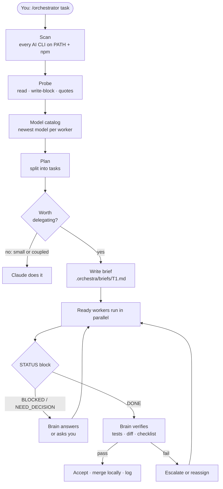
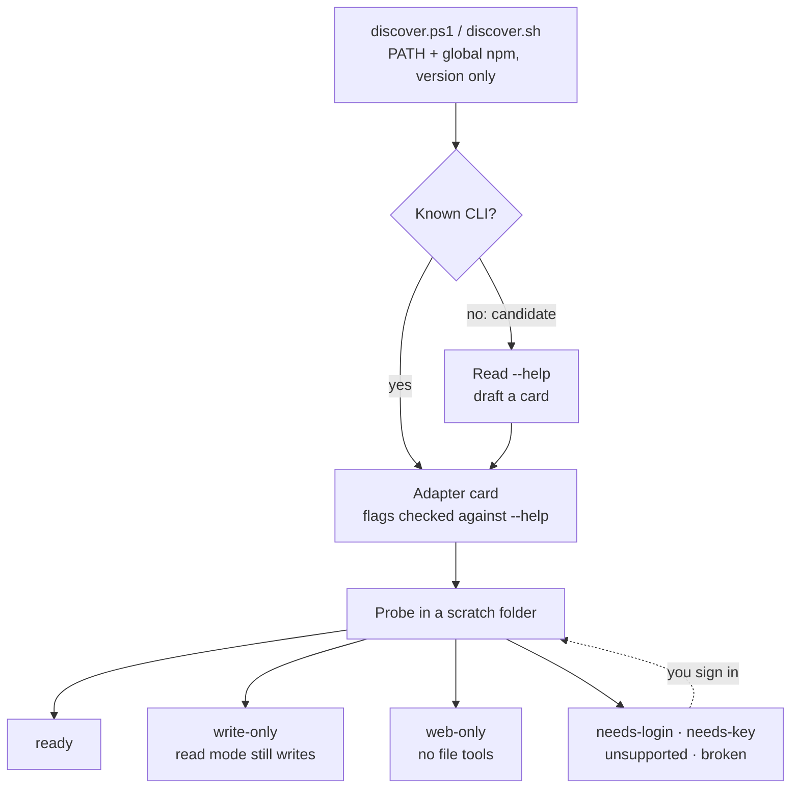
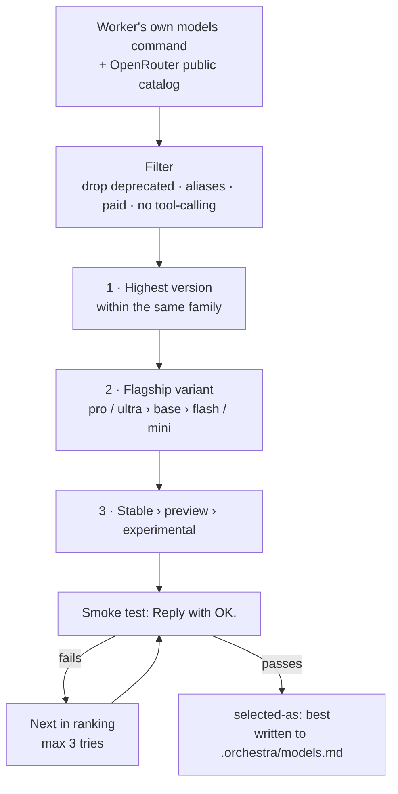

<p align="center">
  
</p>

<p align="center">
  <a href="#-features">Features</a> ·
  <a href="#-how-it-works">How it works</a> ·
  <a href="#-worker-discovery">Discovery</a> ·
  <a href="#-install">Install</a> ·
  <a href="#-usage">Usage</a> ·
  <a href="#-safety">Safety</a> ·
  <a href="#-troubleshooting">Troubleshooting</a>
</p>

<p align="center">
  
  
  
  
  
  
</p>

<p align="center">
  <b>English</b> · <a href="README.zh-CN.md">简体中文</a> · <a href="README.es.md">Español</a>
</p>

---

**OrkestraKu** is a [Claude Code](https://claude.com/claude-code) skill that turns your Claude session into the **conductor** of an AI orchestra. You type `/orchestrator <task>`; Claude plans the work, splits off the parts that are independent, hands each one to the worker that fits it best, and **checks every result itself** before accepting it.

The workers are **whatever AI command-line tools you have installed**. OrkestraKu scans your machine, recognises 43 AI CLIs by name (grok, Antigravity/Gemini, opencode, Qwen Code, Kimi Code, MiMo, Hermes, Codex, Aider, Crush and more), spots unfamiliar ones among your global npm packages, and **test-drives each one** before trusting it. Claude's own **subagents** are always in the band. Claude calls the workers straight from the shell: no MCP bridge, no wrapper package, no server.

> *Orkestra* is Indonesian for orchestra; *-Ku* means "mine". Your own orchestra of AI workers.

---

## ✨ Features

| | Feature | Details |
|:-:|---|---|
| 🔎 | **Finds every AI CLI you have** | A read-only scanner checks your PATH for 43 known AI CLIs and your global npm packages for unknown ones. It only runs version commands. |
| 🧪 | **Test-drives before trusting** | Each CLI gets a three-in-one probe in a scratch folder: can it read a file, does its read-only mode really block writes, do quotes survive the trip. |
| 🏷️ | **Knows why a CLI is idle** | Every failure is classified (`needs-login`, `needs-key`, `unsupported`, `broken`, …) with the exact step that would enable it. |
| 🗂️ | **Remembers across projects** | Probe results are cached per CLI version, so slow or paid probes are not repeated. Idle CLIs are re-checked every session, so signing in is picked up at once. |
| 🧠 | **Claude stays the brain** | Plans, decides, supervises and verifies. Nothing is accepted on a worker's word alone. |
| 🎯 | **Uses the whole roster** | Routes by capability (web search, long context, free models, strongest reasoning), spreads parallel tasks across workers, and can ask a cross-vendor panel for second opinions. |
| 🏆 | **Newest model, picked live** | Every session rebuilds each worker's model catalog from its own `models` command, ranks it, and smoke-tests the winner. |
| 🎚️ | **Effort per task** | Low for renames, medium for normal work, high for architecture and final review, mapped to each CLI's real levels. |
| 🆓 | **Free models where billing is per token** | Only `:free` OpenRouter or OpenCode Zen free models. Paid models and metered providers are a hard stop. |
| 🛡️ | **Read-only by default** | Research runs with no auto-approve. File changes happen only in a dedicated git worktree and are reviewed before a local merge. |
| 🔁 | **Escalation and fallback** | Rate limit → next model. Failed twice → higher tier or effort. Still failing → a worker from another vendor, or Claude itself. |
| 📒 | **Learns from its log** | Every run is logged; workers that keep needing rework get passed over. |

---

## 🧭 How it works



A task is delegated only when **all three** are true: it is independent, it can be briefed in five sentences, and its result can be checked by a test, a command or a short checklist. Anything smaller than ~15 minutes of work, Claude simply does itself.

---

## 🔍 Worker discovery

Run `/orchestrator scan` to see it on its own. The scan is quick and costs nothing; the probe runs once per CLI version and is then cached in `~/.claude/orchestra/workers-cache.md`.



| Status | What it means | How it is used |
|---|---|---|
| ✅ `ready` | Passed every probe | Any task that fits its strengths |
| 🟨 `write-only` | Works, but its read-only mode still wrote a file (or it has none) | Only inside a git worktree or on a scratch copy |
| 🌐 `web-only` | Safe only with file and shell tools switched off | Web research |
| 🔑 `needs-login` / `needs-key` | Installed, not signed in or no provider configured | Idle; Claude tells you the exact command |
| ⛔ `unsupported` | The vendor ended the plan this client relies on | Idle, with the reason |
| 🧩 `broken` | Fails to start | Idle, with the fix |
| 🚫 `excluded` | Claude Code itself, or a gateway that can message people | Never a worker unless you opt in |

**Any other CLI.** When the scan finds an agent CLI it has no card for, Claude reads its `--help`, drafts an adapter (headless flag, model flag, read-only mode, JSON output) and runs the same probe. It is used only if it passes, and flags that approve everything (`--yolo`, `--dangerously-*`, `bypass…`) are never used.

### Who plays what

Routing is by capability, so a newly signed-in CLI joins the band right away.

| Work type | Needs | Typical best fit |
|---|---|---|
| Web and X research, current events | web search | grok · hermes (`web-only`) |
| Large repos, long documents, summaries | long context | agy (Gemini) · mimo / kimi when ready |
| Boilerplate, renames, simple tests | cheap or free, file edits | opencode (free models) · qwen / kimi when ready |
| Critical code, architecture, review | strongest reasoning | Claude subagent |
| Second opinion | a different vendor family than the author | any ready worker from another vendor |

Independent tasks are spread across workers (at most 2 per worker, 5 in total) instead of queueing on one. For high-stakes research or review, Claude can send the same read-only brief to a **panel** of 2–3 workers from different vendors and check every point they disagree on.

### How the model is chosen



---

## 🚀 Install

You need **[Claude Code](https://claude.com/claude-code)**. Worker CLIs are optional: with none at all the skill still works using Claude subagents.

**Windows: PowerShell**

```powershell
irm https://raw.githubusercontent.com/yoelkh/orkestraku/main/install.ps1 | iex
```

**Windows: Command Prompt (cmd)**

```bat
powershell -NoProfile -ExecutionPolicy Bypass -Command "irm https://raw.githubusercontent.com/yoelkh/orkestraku/main/install.ps1 | iex"
```

**macOS / Linux / Git Bash**

```bash
curl -fsSL https://raw.githubusercontent.com/yoelkh/orkestraku/main/install.sh | sh
```

The installer copies the skill to `~/.claude/skills/orchestrator/`, backs up any file it replaces to `~/.claude/orchestra/backups/`, then scans for AI CLIs:

```text
  OrkestraKu  /orchestrator skill for Claude Code

  [OK] Installed C:\Users\you\.claude\skills\orchestrator  (4 new, 0 updated, 0 unchanged)

  AI CLIs found on this machine
  [OK] grok         agent     grok 1.0.50 (c58f321264ba) [stable]
  [OK] agy          agent     1.3.2
  [OK] opencode     agent     1.18.35
  [OK] qwen         agent     0.21.8
  [OK] kimi         agent     0.18.0
  [OK] hermes       agent     Hermes Agent v0.19.1 (2026.7.30)
  [--] claude       brain     2.1.269 (Claude Code)  (not used as a worker)
  [OK] sub          agent     Claude subagents (always available)
```

"Found" is not the same as "ready": run `/orchestrator scan` in Claude Code to probe them.

<details>
<summary><b>More options: project scope, a specific version, uninstall, manual install</b></summary>

| What | PowerShell | macOS / Linux |
|---|---|---|
| Install only for the current project (`./.claude/skills`) | `& ([scriptblock]::Create((irm https://raw.githubusercontent.com/yoelkh/orkestraku/main/install.ps1))) -Scope project` | `curl -fsSL …/install.sh \| sh -s -- --project` |
| Install a tag or branch | `… -Ref v1.0.0` | `… \| sh -s -- --ref v1.0.0` |
| Skip the CLI scan | `… -NoScan` | `… \| sh -s -- --no-scan` |
| Update | run the install command again | run the install command again |
| Uninstall | `& ([scriptblock]::Create((irm https://raw.githubusercontent.com/yoelkh/orkestraku/main/install.ps1))) -Uninstall` | `curl -fsSL …/install.sh \| sh -s -- --uninstall` |

**Manual:** copy the [`skills/orchestrator/`](skills/orchestrator) folder to `~/.claude/skills/orchestrator/`.

</details>

---

## 🪄 Usage

In Claude Code:

```text
/orchestrator [workers=<list>] [tier=best|fast|standard|strong] [effort=auto|low|medium|high] [mode=supervised|auto] [rescan] <task>
```

| Example | What happens |
|---|---|
| `/orchestrator scan` | Scans, probes and shows the worker table, with the step that would enable each idle CLI. |
| `/orchestrator compare the 3 most popular Rust web frameworks for a small API` | Parallel research by the best-fit ready workers, synthesised and fact-checked by Claude. |
| `/orchestrator review src/auth for security issues, get a second opinion` | A cross-vendor panel reviews; Claude checks every point they disagree on. |
| `/orchestrator workers=agy:pro,opencode tier=fast add unit tests for src/utils` | agy pinned to its Pro family, cheaper models elsewhere. |
| `/orchestrator workers=-hermes …` | Everything ready except hermes. |
| `/orchestrator rescan …` | Ignores the cache and probes every CLI again first. |
| `/orchestrator mode=auto rename the Logger API to Telemetry across the repo` | Runs end to end without asking, inside git worktrees, within its budget. |

You can steer it mid-session in plain language, in any language: *"T2 use agy pro"*, *"everything on fast"*, *"don't use hermes"*, *"switch to auto"*.

### Modes

| | **supervised** (default) | **auto** |
|---|---|---|
| Before launching | Shows the worker table and a `task · worker · model · tier · effort · profile` plan, then waits for you | Starts immediately |
| Worker asks a question | Scope or architecture → asks you. Technical → answers itself | Answers itself, picking the most reversible option, and logs it |
| Escalation | Asks first | Automatic |
| Budget | none | max 10 delegations (panel members count), 2 resumes each |
| Hard stops | always | always |

---

## 🔒 Safety

**Two permission profiles per worker.** These are the profiles of the CLIs tested so far; others get theirs from onboarding.

| Worker | READ profile (research, review) | WRITE profile (git worktree only) |
|---|---|---|
| grok | no approve flag · write attempts are cancelled | `--always-approve` |
| agy (Gemini) | `--mode plan`¹ | `--mode accept-edits` |
| opencode | `--agent plan`² | `--auto` |
| mimo | `--agent plan` | worktree only |
| qwen | `--approval-mode plan` (pending probe) | worktree only |
| kimi | none headless³ → `write-only` | `--auto` |
| hermes | `-t web` only⁴ → `web-only` | not used |
| subagent | read-only brief | own worktree |

¹ When agy's global setting `toolPermission` is `always-proceed`, plan mode **still writes files** (verified). The skill reads that setting and treats agy as `write-only`.
² opencode's default agent writes files even without `--auto` (verified).
³ `kimi --plan` cannot be combined with `--prompt` (verified).
⁴ `hermes -z` auto-approves every tool, and its defaults include terminal, files and computer use. Only the web toolset is ever enabled.

After every READ run, Claude checks that no project file changed; a worker that changes something is demoted to `write-only`.

**Hard stops** that are never automatic, in any mode: pushing to a remote, touching `main`/`master`, deleting files outside `.orchestra/`, anything that leaves your machine (including messaging gateways), spending money (paid models, metered providers), secrets and `.env` files (never opened, even while probing), installing packages or logging CLIs in, and anything git cannot undo.

**Never used:** `--yolo`, `--dangerously-*`, `bypassPermissions`, `--approval-mode yolo`, `--never-ask`, or a global always-approve setting.

---

## 📂 What it creates

In your project (`.orchestra/` is added to `.gitignore` when the project uses git):

```text
.orchestra/
├── models.md           # today's model catalog, ranking and smoke-test results
├── orchestra-log.md    # one line per delegated task: worker, model, effort, outcome
├── briefs/T1.md        # what each worker was asked to do
├── runs/T1.out|.err    # raw worker output
├── runs/index.md       # task → worker, model, session ID, start time
└── wt/T1/              # git worktree for WRITE tasks (removed after merge)
```

Shared across projects:

```text
~/.claude/orchestra/
├── workers-cache.md    # status, profile, strengths and best model per CLI version
└── backups/            # files the installer replaced
```

Ask *"is orchestration worth it?"* or *"which model works best for tests?"* and Claude answers from `orchestra-log.md`, not from guesses.

---

## 🩺 Troubleshooting

| Symptom | Cause and fix |
|---|---|
| A CLI shows `needs-login` | Sign in yourself: `grok login`, `kimi login`, … The skill never logs in for you. Its next preflight picks it up. |
| A CLI shows `needs-key` | Configure a provider yourself: `hermes model`, `mimo providers`, Qwen Code auth settings. |
| `gemini` shows `unsupported` | The free Gemini Code Assist plan no longer accepts the Gemini CLI. Use Antigravity (`agy`) for Gemini. |
| `mimo` says *"MiMo free API service has ended"* | Sign in or add a third-party API with `mimo providers`. |
| `opencode` fails with *"not a valid application for this OS"* or *"postinstall script was not run"* | npm skipped opencode's postinstall. Run `cd "$env:APPDATA\npm\node_modules\opencode-ai"; node postinstall.mjs`. |
| OpenRouter free models fail with *"guardrail restrictions and data policy"* | Your OpenRouter privacy settings block free models. Allow it at [openrouter.ai/settings/privacy](https://openrouter.ai/settings/privacy), or let the skill use OpenCode Zen free models. |
| agy writes files during a read-only task | `toolPermission: "always-proceed"` in `~/.gemini/antigravity-cli/settings.json`. See [Safety](#-safety). |
| A brief arrives with missing quotes (Windows) | Windows PowerShell 5.1 strips `"` from native arguments. The skill passes briefs through files (`--prompt-file` or a one-line pointer prompt), never as raw arguments. |
| You signed in but the skill still says idle | Say `rescan`, or run `/orchestrator rescan <task>`. |
| Claude asks permission before each worker command | That is Claude Code's own permission mode, not this skill. Add allow rules in Claude Code settings if you want fewer prompts. |

---

## 🧪 Tested on

Validated on 10 October 2026, Windows 11, PowerShell 5.1. Discovery found 10 known CLIs and 2 npm candidates in about 15 seconds.

| CLI | Status found | Notes |
|---|---|---|
| grok 1.0.50 · `grok-4.7` | ✅ ready | 5 s · reads files and searches the web in READ · writes cancelled |
| agy 1.3.2 · `gemini-3.8-flash-high` | 🟨 write-only | ~50 s · plan mode writes when `always-proceed` is set |
| opencode 1.18.35 · `opencode/nemotron-3-ultra-free` | ✅ ready | 24 s · `--agent plan` blocks writes |
| Claude subagent · `fable` | ✅ ready | |
| qwen 0.21.8 | 🔑 needs-key | "No auth type is selected" |
| kimi 0.18.0 | 🔑 needs-login | `--plan` not allowed with `--prompt` |
| mimo 0.1.10 | 🔑 needs-key | free API service ended |
| hermes 0.19.1 | 🔑 needs-key | one-shot mode bypasses approvals → web-only |
| gemini 0.55.1 | ⛔ unsupported | free Code Assist plan no longer accepts this client |
| openclaw · claude | 🚫 excluded | gateway · brain |

Also checked: briefs containing `"quotes"`, `&`, `\|`, `>` arrive intact on every ready CLI. Both scanners (PowerShell and sh) return the same result. Both installers handle a fresh install, "already up to date", an update with backup, rejecting an invalid file, and uninstall.

---

## 📄 License

[MIT](LICENSE) © 2026 yoelkh
