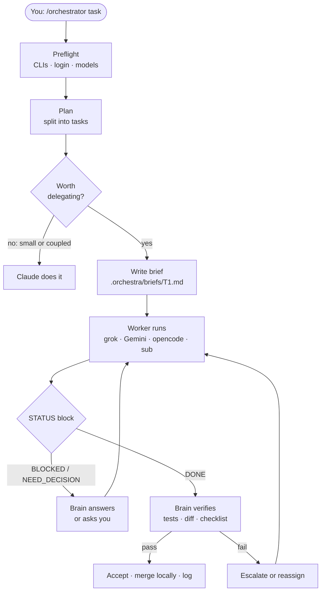
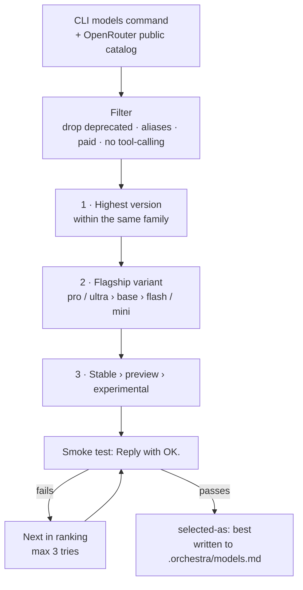

<p align="center">
  
</p>

<p align="center">
  <a href="#-features">Features</a> ·
  <a href="#-how-it-works">How it works</a> ·
  <a href="#-install">Install</a> ·
  <a href="#-usage">Usage</a> ·
  <a href="#-safety">Safety</a> ·
  <a href="#-troubleshooting">Troubleshooting</a>
</p>

<p align="center">
  
  
  
  
  
</p>

<p align="center">
  <b>English</b> · <a href="README.zh-CN.md">简体中文</a> · <a href="README.es.md">Español</a>
</p>

---

**OrkestraKu** is a [Claude Code](https://claude.com/claude-code) skill that turns your Claude session into the **conductor** of a small AI orchestra. You type `/orchestrator <task>`; Claude plans the work, splits off the parts that are independent, hands each one to the worker that fits it best, and **checks every result itself** before accepting it.

Workers are the AI command-line tools you already have: **grok**, **Gemini** (Antigravity CLI `agy`), **opencode**, and Claude's own **subagents**. Claude calls them straight from the shell. There is no MCP bridge, no wrapper package and no server to run: the whole thing is one `SKILL.md` file.

> *Orkestra* is Indonesian for orchestra; *-Ku* means "mine". Your own orchestra of AI workers.

---

## ✨ Features

| | Feature | Details |
|:-:|---|---|
| 🧠 | **Claude stays the brain** | Plans, decides, supervises and verifies. Workers do the bulk work; nothing is accepted on a worker's word alone. |
| 🎯 | **Right worker per task** | Web research → grok, long documents → Gemini, mechanical edits → opencode, critical code → Claude subagent. |
| 🏆 | **Newest model, picked live** | Every session rebuilds the model catalog from each CLI's own `models` command, ranks it, and smoke-tests the winner. No stale model names. |
| 🎚️ | **Effort per task** | Low for renames, medium for normal work, high for architecture and final review. Mapped to each CLI's real effort levels. |
| 🆓 | **Free models first on opencode** | Only `:free` OpenRouter models or OpenCode Zen free models. Paid models are a hard stop. |
| 🛡️ | **Read-only by default** | Research runs with no auto-approve. File changes happen only in a dedicated git worktree, then get reviewed and merged locally. |
| 🔁 | **Escalation and fallback** | Rate limit → next model. Failed twice → higher tier or effort. Still failing → another worker, or Claude does it. |
| 🕹️ | **Supervised or auto** | Supervised asks before launching and on scope questions. Auto runs end to end with a budget and hard stops. |
| 📒 | **Learns from its log** | Every run is logged. Workers that keep needing rework get passed over next time. |

---

## 🧭 How it works



A task is delegated only when **all three** are true: it is independent, it can be briefed in five sentences, and its result can be checked by a test, a command or a short checklist. Anything smaller than ~15 minutes of work, Claude simply does itself.

### Who plays what

| Worker | CLI | Best at | Default model (Oct 2026) |
|---|---|---|---|
| 🌐 **grok** | `grok` | Web and X research, current events, second opinions | `grok-4.7` |
| 📚 **Gemini** | `agy` | Large repos, long documents, summaries, docs drafts | `gemini-3.8-flash-high` |
| 🔧 **opencode** | `opencode` | Boilerplate, renames, simple tests, formatting | best free model available |
| 🧩 **subagent** | built into Claude Code | Critical code, architecture, code review | `fable`, else `opus` |

The model column is only a snapshot. The skill never uses a hard-coded list; it re-reads each CLI's catalog every session.

### How the model is chosen



---

## 🚀 Install

You need **[Claude Code](https://claude.com/claude-code)**. Worker CLIs are optional: any that are missing are skipped, and with none at all the skill still works using Claude subagents.

**Windows: PowerShell**

```powershell
irm https://raw.githubusercontent.com/yoelkh/orkestraku/main/install.ps1 | iex
```

**Windows: Command Prompt (cmd)**

```bat
powershell -NoProfile -ExecutionPolicy Bypass -Command "irm https://raw.githubusercontent.com/yoelkh/orkestraku/main/install.ps1 | iex"
```

**macOS / Linux / Git Bash**

```bash
curl -fsSL https://raw.githubusercontent.com/yoelkh/orkestraku/main/install.sh | sh
```

The installer copies `SKILL.md` to `~/.claude/skills/orchestrator/`, backs up any different version that was there, and then lists which workers it found:

```text
  OrkestraKu  /orchestrator skill for Claude Code

  [OK] Installed C:\Users\you\.claude\skills\orchestrator\SKILL.md

  Workers
  [OK] grok      grok 1.0.50 (c58f321264ba) [stable]
  [OK] agy       1.3.2
  [OK] opencode  1.18.35
  [OK] sub       Claude subagents (always available inside Claude Code)
```

<details>
<summary><b>More options: project scope, a specific version, uninstall, manual install</b></summary>

| What | PowerShell | macOS / Linux |
|---|---|---|
| Install only for the current project (`./.claude/skills`) | `& ([scriptblock]::Create((irm https://raw.githubusercontent.com/yoelkh/orkestraku/main/install.ps1))) -Scope project` | `curl -fsSL …/install.sh \| sh -s -- --project` |
| Install a tag or branch | `… -Ref v1.0.0` | `… \| sh -s -- --ref v1.0.0` |
| Update | run the install command again | run the install command again |
| Uninstall | `& ([scriptblock]::Create((irm https://raw.githubusercontent.com/yoelkh/orkestraku/main/install.ps1))) -Uninstall` | `curl -fsSL …/install.sh \| sh -s -- --uninstall` |

**Manual:** download [`skills/orchestrator/SKILL.md`](skills/orchestrator/SKILL.md) and save it as `~/.claude/skills/orchestrator/SKILL.md`.

</details>

### Setting up the workers (optional)

| Worker | Install | Sign in (you do this, never the skill) |
|---|---|---|
| grok | [x.ai](https://x.ai) | `grok login` |
| Gemini | Antigravity CLI (`agy`) | sign in on first run |
| opencode | `npm i -g opencode-ai` | `opencode auth login` (OpenRouter key optional) |
| subagent | built in | nothing to do |

---

## 🎛️ Usage

In Claude Code:

```text
/orchestrator [workers=<list>] [tier=best|fast|standard|strong] [effort=auto|low|medium|high] [mode=supervised|auto] <task>
```

| Example | What happens |
|---|---|
| `/orchestrator compare the 3 most popular Rust web frameworks for a small API` | Parallel research by the best-fit workers, synthesised and fact-checked by Claude. |
| `/orchestrator workers=grok,sub summarise this week's news on WebGPU and review our renderer for gaps` | Only grok and subagents take part. |
| `/orchestrator workers=gemini:pro,opencode tier=fast add unit tests for src/utils` | Gemini pinned to its Pro family, cheaper models elsewhere. |
| `/orchestrator mode=auto rename the Logger API to Telemetry across the repo` | Runs end to end without asking, inside git worktrees, within its budget. |
| `/orchestrator workers=ask …` | Lets you tick workers and models from a list. |

You can steer it in plain language mid-session, in any language: *"T2 use gemini pro"*, *"everything on fast"*, *"raise the effort"*, *"switch to auto"*.

### Modes

| | **supervised** (default) | **auto** |
|---|---|---|
| Before launching | Shows a `task · worker · model · tier · effort · profile` table and waits for you | Starts immediately |
| Worker asks a question | Scope or architecture → asks you. Technical → answers itself | Answers itself, picking the most reversible option, and logs the decision |
| Escalation | Asks first | Automatic |
| Budget | none | max 10 delegations, 2 resumes each |
| Hard stops | always | always |

---

## 🛡️ Safety

**Two permission profiles.** Claude picks one per task:

| Worker | READ profile (research, review) | WRITE profile (git worktree only) |
|---|---|---|
| grok | no approve flag · write attempts are cancelled | `--always-approve` |
| Gemini (`agy`) | `--mode plan`* | `--mode accept-edits` |
| opencode | `--agent plan` | `--auto` |
| subagent | read-only brief | own worktree |

\* Checked during development: when agy's global setting `toolPermission` is `always-proceed`, plan mode **still writes files**. The skill reads that setting at preflight and, if it is set, runs agy read tasks only on a scratch copy or in a worktree. After every READ run the brain also checks that no project file changed.

**Hard stops** that are never automatic, in any mode: pushing to a remote, touching `main`/`master`, deleting files outside `.orchestra/`, anything that leaves your machine, spending money (including paid models), secrets and `.env` files, installing packages globally or logging CLIs in, and anything git cannot undo.

**Never used:** `agy --dangerously-skip-permissions`, `grok --yolo`, or a global always-approve setting. Briefs never contain secrets or client documents.

---

## 📂 What it creates

Everything goes into `.orchestra/` in your project (added to `.gitignore` automatically when the project uses git):

```text
.orchestra/
├── models.md           # today's model catalog, ranking and smoke-test results
├── orchestra-log.md    # one line per delegated task: worker, model, effort, outcome
├── briefs/T1.md        # what each worker was asked to do
├── runs/T1.out|.err    # raw worker output
├── runs/index.md       # task → worker, model, session ID, start time
└── wt/T1/              # git worktree for WRITE tasks (removed after merge)
```

Ask *"is orchestration worth it?"* or *"which model works best for tests?"* and Claude answers from `orchestra-log.md`, not from guesses.

---

## 🩺 Troubleshooting

| Symptom | Cause and fix |
|---|---|
| `opencode` fails with *"not a valid application for this OS"* or *"postinstall script was not run"* | npm skipped opencode's postinstall. Run `cd "$env:APPDATA\npm\node_modules\opencode-ai"; node postinstall.mjs`. |
| OpenRouter free models fail with *"guardrail restrictions and data policy"* | Your OpenRouter privacy settings block free models. Allow it at [openrouter.ai/settings/privacy](https://openrouter.ai/settings/privacy), or let the skill use OpenCode Zen free models instead. |
| grok says you are not logged in | Run `grok login` yourself. The skill never logs in for you. |
| Gemini writes files during a read-only task | `toolPermission: "always-proceed"` in `~/.gemini/antigravity-cli/settings.json`. See [Safety](#-safety). |
| Worker receives a brief with missing quotes (Windows) | Windows PowerShell 5.1 strips `"` from native arguments. The skill passes briefs through files (`--prompt-file` or a one-line pointer prompt), never as raw arguments. |
| Claude keeps asking permission before each worker command | That is Claude Code's own permission mode, not this skill. Add allow rules in Claude Code settings if you want fewer prompts. |

---

## 🧪 Tested on

Validated on 10 October 2026 on Windows 11 with PowerShell 5.1:

| Check | Result |
|---|---|
| grok 1.0.50 · `grok-4.7` | ✅ smoke test 5 s · reads files and searches the web in READ · writes cancelled |
| agy 1.3.2 · `gemini-3.8-flash-high` | ✅ smoke test ~50 s · ⚠️ plan mode writes when `always-proceed` is set |
| opencode 1.18.35 · `opencode/nemotron-3-ultra-free` | ✅ smoke test 24 s · `--agent plan` blocks writes |
| Claude subagent · `fable` | ✅ |
| Briefs containing `"quotes"`, `&`, `\|`, `>` | ✅ arrive intact through files on all three CLIs |
| `install.ps1` and `install.sh` | ✅ install · already up to date · backup · reject invalid file · uninstall |

---

## 📄 License

[MIT](LICENSE) © 2026 yoelkh
