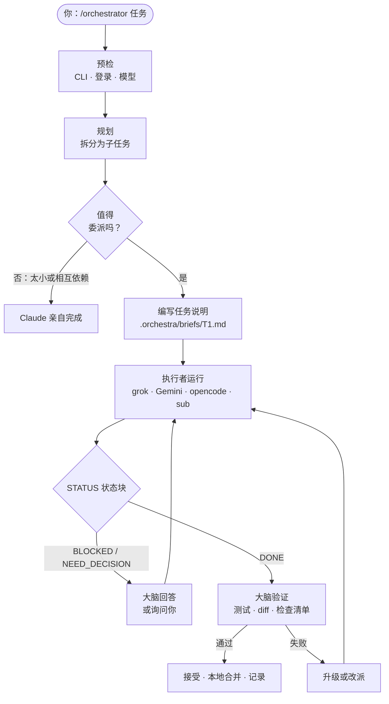
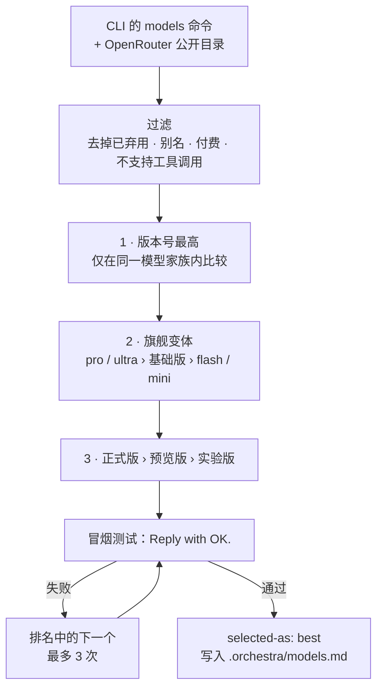

<p align="center">
  
</p>

<p align="center">
  <a href="#-功能">功能</a> ·
  <a href="#-工作原理">工作原理</a> ·
  <a href="#-安装">安装</a> ·
  <a href="#-使用">使用</a> ·
  <a href="#-安全">安全</a> ·
  <a href="#-故障排查">故障排查</a>
</p>

<p align="center">
  
  
  
  
  
</p>

<p align="center">
  <a href="README.md">English</a> · <b>简体中文</b> · <a href="README.es.md">Español</a>
</p>

---

**OrkestraKu** 是一个 [Claude Code](https://claude.com/claude-code) 技能（skill），让你的 Claude 会话成为一支 AI 小乐团的**指挥**。输入 `/orchestrator <任务>`，Claude 会规划工作、拆出彼此独立的部分、把每一部分交给最合适的执行者（worker），并在接受结果之前**亲自验证每一个结果**。

执行者就是你已经安装的 AI 命令行工具：**grok**、**Gemini**（Antigravity CLI `agy`）、**opencode**，以及 Claude 自己的**子代理**（subagent）。Claude 直接在 shell 中调用它们：没有 MCP 桥接、没有封装包、也不需要运行任何服务。整个项目只是一个 `SKILL.md` 文件。

> *Orkestra* 是印尼语的"乐团"，*-Ku* 意为"我的"。属于你自己的 AI 乐团。

---

## ✨ 功能

| | 功能 | 说明 |
|:-:|---|---|
| 🧠 | **Claude 始终是大脑** | 负责规划、决策、监督和验证。执行者完成主要工作；任何结果都不会仅凭执行者的一面之词就被接受。 |
| 🎯 | **按任务选择执行者** | 网络调研 → grok，长文档 → Gemini，机械性修改 → opencode，关键代码 → Claude 子代理。 |
| 🏆 | **实时选择最新模型** | 每次会话都从各 CLI 自带的 `models` 命令重建模型目录、排序，并对胜出者做冒烟测试。不会使用过时的模型名。 |
| 🎚️ | **按任务设定推理强度** | 重命名用 low，常规工作用 medium，架构与最终审查用 high，并映射到各 CLI 实际支持的级别。 |
| 🆓 | **opencode 优先使用免费模型** | 只使用 OpenRouter 的 `:free` 模型或 OpenCode Zen 免费模型。付费模型属于硬性禁止项。 |
| 🛡️ | **默认只读** | 调研任务不开启自动批准。文件修改只在专用的 git worktree 中进行，审查通过后才在本地合并。 |
| 🔁 | **升级与回退** | 遇到限流 → 换下一个模型。连续失败两次 → 提高档位或强度。仍然失败 → 换执行者，或由 Claude 亲自完成。 |
| 🕹️ | **监督模式或自动模式** | 监督模式在启动前和涉及范围的问题上会询问你；自动模式在预算和硬性禁止项内一口气完成。 |
| 📒 | **从日志中学习** | 每次运行都会记录。经常需要返工的执行者下次会被优先跳过。 |

---

## 🧭 工作原理



只有同时满足**三个条件**的任务才会被委派：它是独立的；能用五句话说明清楚；结果可以通过测试、命令或简短的检查清单来验证。任何少于约 15 分钟工作量的事情，Claude 会直接自己做。

### 分工

| 执行者 | CLI | 擅长 | 默认模型（2026 年 10 月） |
|---|---|---|---|
| 🌐 **grok** | `grok` | 网络与 X 调研、时事、第二意见 | `grok-4.7` |
| 📚 **Gemini** | `agy` | 大型仓库、长文档、摘要、文档草稿 | `gemini-3.8-flash-high` |
| 🔧 **opencode** | `opencode` | 样板代码、重命名、简单测试、格式化 | 当前最佳免费模型 |
| 🧩 **子代理** | Claude Code 内置 | 关键代码、架构、代码审查 | `fable`，否则 `opus` |

"默认模型"一列只是快照。该技能从不使用写死的列表，每次会话都会重新读取各 CLI 的模型目录。

### 模型如何选择



---

## 🚀 安装

需要先安装 **[Claude Code](https://claude.com/claude-code)**。执行者 CLI 都是可选的：缺少的会被自动跳过；即使一个都没有，该技能也能只用 Claude 子代理运行。

**Windows：PowerShell**

```powershell
irm https://raw.githubusercontent.com/yoelkh/orkestraku/main/install.ps1 | iex
```

**Windows：命令提示符（cmd）**

```bat
powershell -NoProfile -ExecutionPolicy Bypass -Command "irm https://raw.githubusercontent.com/yoelkh/orkestraku/main/install.ps1 | iex"
```

**macOS / Linux / Git Bash**

```bash
curl -fsSL https://raw.githubusercontent.com/yoelkh/orkestraku/main/install.sh | sh
```

安装程序会把 `SKILL.md` 复制到 `~/.claude/skills/orchestrator/`，如果那里已有不同版本会先备份，然后列出找到的执行者：

```text
  OrkestraKu  /orchestrator skill for Claude Code

  [OK] Installed C:\Users\you\.claude\skills\orchestrator\SKILL.md

  Workers
  [OK] grok      grok 1.0.50 (c58f321264ba) [stable]
  [OK] agy       1.3.2
  [OK] opencode  1.18.35
  [OK] sub       Claude subagents (always available inside Claude Code)
```

<details>
<summary><b>更多选项：项目级安装、指定版本、卸载、手动安装</b></summary>

| 操作 | PowerShell | macOS / Linux |
|---|---|---|
| 仅为当前项目安装（`./.claude/skills`） | `& ([scriptblock]::Create((irm https://raw.githubusercontent.com/yoelkh/orkestraku/main/install.ps1))) -Scope project` | `curl -fsSL …/install.sh \| sh -s -- --project` |
| 安装指定标签或分支 | `… -Ref v1.0.0` | `… \| sh -s -- --ref v1.0.0` |
| 更新 | 重新运行安装命令 | 重新运行安装命令 |
| 卸载 | `& ([scriptblock]::Create((irm https://raw.githubusercontent.com/yoelkh/orkestraku/main/install.ps1))) -Uninstall` | `curl -fsSL …/install.sh \| sh -s -- --uninstall` |

**手动安装：** 下载 [`skills/orchestrator/SKILL.md`](skills/orchestrator/SKILL.md)，保存为 `~/.claude/skills/orchestrator/SKILL.md`。

</details>

### 配置执行者（可选）

| 执行者 | 安装 | 登录（由你操作，技能永远不会代你登录） |
|---|---|---|
| grok | [x.ai](https://x.ai) | `grok login` |
| Gemini | Antigravity CLI（`agy`） | 首次运行时登录 |
| opencode | `npm i -g opencode-ai` | `opencode auth login`（OpenRouter 密钥可选） |
| 子代理 | 内置 | 无需操作 |

---

## 🪄 使用

在 Claude Code 中：

```text
/orchestrator [workers=<列表>] [tier=best|fast|standard|strong] [effort=auto|low|medium|high] [mode=supervised|auto] <任务>
```

| 示例 | 效果 |
|---|---|
| `/orchestrator 比较三个最流行的 Rust Web 框架，用于一个小型 API` | 由最合适的执行者并行调研，Claude 汇总并核实事实。 |
| `/orchestrator workers=grok,sub 总结本周 WebGPU 的新闻，并审查我们的渲染器还缺什么` | 只有 grok 和子代理参与。 |
| `/orchestrator workers=gemini:pro,opencode tier=fast 为 src/utils 添加单元测试` | Gemini 固定使用 Pro 系列，其余使用更便宜的模型。 |
| `/orchestrator mode=auto 在整个仓库中把 Logger API 重命名为 Telemetry` | 在 git worktree 中、预算范围内一口气完成，不中途询问。 |
| `/orchestrator workers=ask …` | 让你从列表中勾选执行者和模型。 |

会话进行中可以用任何语言、用自然的话来调整：*"T2 用 gemini pro"*、*"全部用 fast"*、*"提高强度"*、*"切换到自动模式"*。

### 模式

| | **supervised**（默认，监督） | **auto**（自动） |
|---|---|---|
| 启动前 | 展示 `任务 · 执行者 · 模型 · 档位 · 强度 · 权限` 表格并等待你确认 | 立即开始 |
| 执行者提问时 | 涉及范围或架构 → 问你；纯技术问题 → 自己回答 | 自己回答，选择最可逆的方案并记录决定 |
| 升级 | 先询问 | 自动 |
| 预算 | 无 | 最多 10 次委派，每个任务最多恢复 2 次 |
| 硬性禁止项 | 始终生效 | 始终生效 |

---

## 🔒 安全

**两种权限配置。** Claude 为每个任务选择其一：

| 执行者 | READ 配置（调研、审查） | WRITE 配置（仅限 git worktree） |
|---|---|---|
| grok | 不加批准参数 · 写入尝试会被取消 | `--always-approve` |
| Gemini（`agy`） | `--mode plan`* | `--mode accept-edits` |
| opencode | `--agent plan` | `--auto` |
| 子代理 | 只读任务说明 | 独立 worktree |

\* 开发过程中实测发现：当 agy 的全局设置 `toolPermission` 为 `always-proceed` 时，plan 模式**仍然会写文件**。该技能在预检时会读取这个设置；如果已开启，agy 的只读任务只会在临时副本或 worktree 中运行。每次 READ 运行之后，大脑还会检查项目文件是否有任何改动。

**硬性禁止项**（任何模式下都不会自动执行）：推送到远程仓库、改动 `main`/`master`、删除 `.orchestra/` 之外的文件、任何离开你电脑的操作、花钱（包括付费模型）、密钥和 `.env` 文件、全局安装软件包或替 CLI 登录，以及任何 git 无法撤销的操作。

**从不使用：** `agy --dangerously-skip-permissions`、`grok --yolo`，或全局"始终批准"设置。任务说明中绝不包含密钥或客户文档。

---

## 📂 生成的文件

所有内容都放在项目中的 `.orchestra/` 目录（如果项目使用 git，会自动加入 `.gitignore`）：

```text
.orchestra/
├── models.md           # 当天的模型目录、排名和冒烟测试结果
├── orchestra-log.md    # 每个委派任务一行：执行者、模型、强度、结果
├── briefs/T1.md        # 每个执行者收到的任务说明
├── runs/T1.out|.err    # 执行者的原始输出
├── runs/index.md       # 任务 → 执行者、模型、会话 ID、开始时间
└── wt/T1/              # WRITE 任务的 git worktree（合并后删除）
```

问 *"编排值得吗？"* 或 *"哪个模型写测试最好？"*，Claude 会根据 `orchestra-log.md` 回答，而不是凭猜测。

---

## 🩺 故障排查

| 现象 | 原因与解决方法 |
|---|---|
| `opencode` 报错 *"not a valid application for this OS"* 或 *"postinstall script was not run"* | npm 跳过了 opencode 的 postinstall。运行 `cd "$env:APPDATA\npm\node_modules\opencode-ai"; node postinstall.mjs`。 |
| OpenRouter 免费模型报错 *"guardrail restrictions and data policy"* | 你的 OpenRouter 隐私设置屏蔽了免费模型。可在 [openrouter.ai/settings/privacy](https://openrouter.ai/settings/privacy) 中允许，或让技能改用 OpenCode Zen 免费模型。 |
| grok 提示未登录 | 请自己运行 `grok login`。技能永远不会代你登录。 |
| Gemini 在只读任务中写了文件 | `~/.gemini/antigravity-cli/settings.json` 中设置了 `toolPermission: "always-proceed"`。见[安全](#-安全)。 |
| 执行者收到的任务说明缺少引号（Windows） | Windows PowerShell 5.1 会删除传给原生程序参数中的 `"`。该技能通过文件传递任务说明（`--prompt-file` 或一行指向文件的提示），从不直接作为参数传递。 |
| Claude 每次调用执行者前都请求权限 | 这是 Claude Code 自身的权限模式，与本技能无关。如需减少提示，请在 Claude Code 设置中添加允许规则。 |

---

## 🧪 测试环境

2026 年 10 月 10 日在 Windows 11 + PowerShell 5.1 上验证：

| 检查项 | 结果 |
|---|---|
| grok 1.0.50 · `grok-4.7` | ✅ 冒烟测试 5 秒 · READ 模式下可读文件、可联网搜索 · 写入被取消 |
| agy 1.3.2 · `gemini-3.8-flash-high` | ✅ 冒烟测试约 50 秒 · ⚠️ 设置 `always-proceed` 时 plan 模式会写文件 |
| opencode 1.18.35 · `opencode/nemotron-3-ultra-free` | ✅ 冒烟测试 24 秒 · `--agent plan` 可阻止写入 |
| Claude 子代理 · `fable` | ✅ |
| 包含 `"引号"`、`&`、`\|`、`>` 的任务说明 | ✅ 通过文件传递，三个 CLI 均完整收到 |
| `install.ps1` 和 `install.sh` | ✅ 安装 · 已是最新 · 备份 · 拒绝无效文件 · 卸载 |

---

## 📄 许可证

[MIT](LICENSE) © 2026 yoelkh
