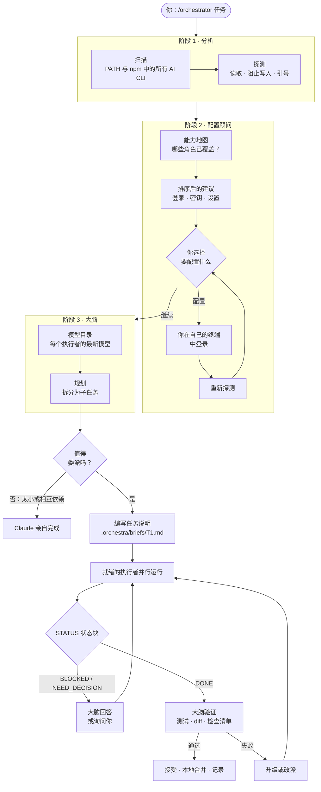
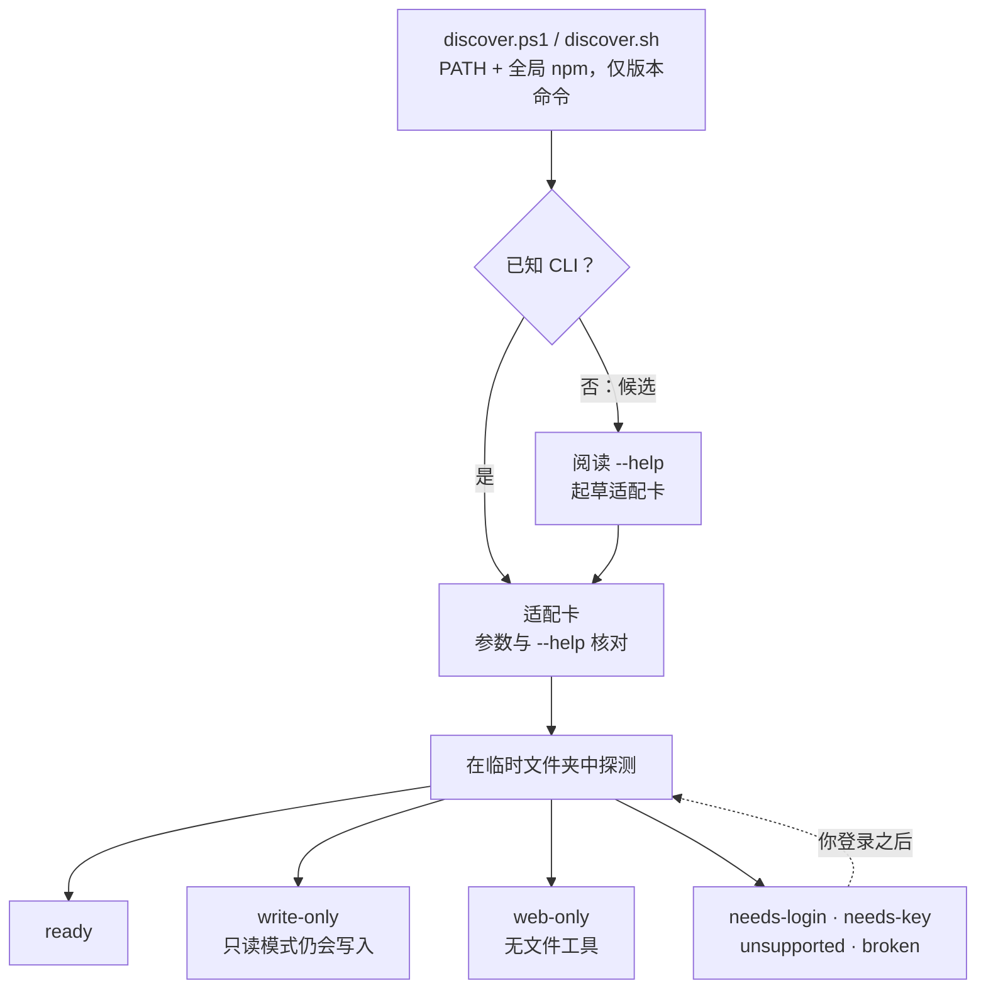
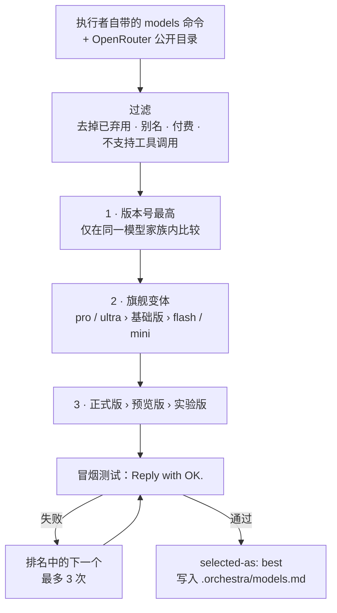

<p align="center">
  
</p>

<p align="center">
  <a href="#-功能">功能</a> ·
  <a href="#-工作原理">工作原理</a> ·
  <a href="#-执行者发现">发现</a> ·
  <a href="#-安装">安装</a> ·
  <a href="#-使用">使用</a> ·
  <a href="#-安全">安全</a> ·
  <a href="#-故障排查">故障排查</a>
</p>

<p align="center">
  
  
  
  
  
  
</p>

<p align="center">
  <a href="README.md">English</a> · <b>简体中文</b> · <a href="README.es.md">Español</a>
</p>

---

**OrkestraKu** 是一个 [Claude Code](https://claude.com/claude-code) 技能（skill），让你的 Claude 会话成为一支 AI 乐团的**指挥**。输入 `/orchestrator <任务>`，Claude 会规划工作、拆出彼此独立的部分、把每一部分交给最合适的执行者（worker），并在接受结果之前**亲自验证每一个结果**。

执行者就是**你已经安装的任何 AI 命令行工具**。OrkestraKu 会扫描你的电脑，按名称识别 43 个 AI CLI（grok、Antigravity/Gemini、opencode、Qwen Code、Kimi Code、MiMo、Hermes、Codex、Aider、Crush 等），在全局 npm 包中找出不认识的候选工具，并在信任之前**逐一试跑**。Claude 自己的**子代理**始终在乐团中。Claude 直接在 shell 中调用执行者：没有 MCP 桥接、没有封装包、也不需要服务。

> *Orkestra* 是印尼语的"乐团"，*-Ku* 意为"我的"。属于你自己的 AI 乐团。

---

## ✨ 功能

| | 功能 | 说明 |
|:-:|---|---|
| 🔎 | **找出你拥有的每一个 AI CLI** | 只读扫描器在 PATH 中查找 43 个已知 AI CLI，并在全局 npm 包中寻找未知候选。它只运行版本命令。 |
| 🧪 | **先试跑，再信任** | 每个 CLI 在临时文件夹中接受一次"三合一"探测：能否读文件、只读模式是否真的阻止写入、引号能否完整传递。 |
| 🏷️ | **知道 CLI 为何闲置** | 每种失败都会被归类（`needs-login`、`needs-key`、`unsupported`、`broken` 等），并给出启用它的确切步骤。 |
| 🧭 | **开工前的配置顾问** | 绘制角色覆盖情况（联网、长上下文、免费修改、跨厂商审查），对最能增强能力的登录和设置排序——免费优先于付费，涉及隐私的取舍从不主动推荐——等你完成后重新探测。 |
| 🗂️ | **跨项目记忆** | 探测结果按 CLI 版本缓存，耗时或收费的探测不会重复。闲置的 CLI 每次会话都会复查，你一登录就能立刻用上。 |
| 🧠 | **Claude 始终是大脑** | 负责规划、决策、监督和验证。任何结果都不会仅凭执行者的一面之词被接受。 |
| 🎯 | **用满整个乐团** | 按能力分配（联网搜索、长上下文、免费模型、最强推理），把并行任务分散到不同执行者，还能请跨厂商"评审团"给出第二意见。 |
| 🏆 | **实时选择最新模型** | 每次会话都从各执行者自带的 `models` 命令重建模型目录、排序，并对胜出者做冒烟测试。 |
| 🎚️ | **按任务设定推理强度** | 重命名用 low，常规工作用 medium，架构与最终审查用 high，并映射到各 CLI 实际支持的级别。 |
| 🆓 | **按 token 计费的地方只用免费模型** | 只使用 OpenRouter `:free` 或 OpenCode Zen 免费模型。付费模型和计量服务属于硬性禁止项。 |
| 🛡️ | **默认只读** | 调研任务不开启自动批准。文件修改只在专用 git worktree 中进行，审查后才在本地合并。 |
| 🔁 | **升级与回退** | 限流 → 换下一个模型。连续失败两次 → 提高档位或强度。仍失败 → 换另一家厂商的执行者，或由 Claude 亲自完成。 |
| 📒 | **从日志中学习** | 每次运行都会记录；经常需要返工的执行者会被跳过。 |

---

## 🧭 工作原理

每次运行都按顺序经过三个阶段。大脑在确切知道自己有哪些执行者之前，绝不开始工作。



只有同时满足**三个条件**的任务才会被委派：它是独立的；能用五句话说明清楚；结果可以通过测试、命令或简短的检查清单验证。少于约 15 分钟工作量的事情，Claude 会直接自己做。

---

## 🔍 执行者发现

运行 `/orchestrator scan` 可以单独查看。扫描很快且不花钱；探测每个 CLI 版本只运行一次，结果缓存在 `~/.claude/orchestra/workers-cache.md`。



| 状态 | 含义 | 用法 |
|---|---|---|
| ✅ `ready` | 通过所有探测 | 任何符合其特长的任务 |
| 🟨 `write-only` | 可用，但只读模式仍写了文件（或没有只读模式） | 只在 git worktree 或临时副本中使用 |
| 🌐 `web-only` | 只有关闭文件与 shell 工具时才安全 | 网络调研 |
| 🔑 `needs-login` / `needs-key` | 已安装，但未登录或未配置服务商 | 闲置；Claude 会告诉你确切命令 |
| ⛔ `unsupported` | 厂商终止了该客户端依赖的方案 | 闲置，并说明原因 |
| 🧩 `broken` | 无法启动 | 闲置，并给出修复方法 |
| 🚫 `excluded` | Claude Code 本身，或可以向他人发消息的网关 | 除非你主动启用，否则从不作为执行者 |

**其他任何 CLI。** 扫描发现没有适配卡的 AI CLI 时，Claude 会阅读它的 `--help`，起草适配器（非交互参数、模型参数、只读模式、JSON 输出），并运行同样的探测。只有通过才会使用；"全部批准"类参数（`--yolo`、`--dangerously-*`、`bypass…`）永远不会使用。

### 分工

按能力分配，所以刚登录的 CLI 会立刻加入乐团。

| 工作类型 | 需要 | 通常最合适 |
|---|---|---|
| 网络与 X 调研、时事 | 联网搜索 | grok · hermes（`web-only`） |
| 大型仓库、长文档、摘要 | 长上下文 | agy（Gemini）· 就绪后的 mimo / kimi |
| 样板代码、重命名、简单测试 | 便宜或免费、能改文件 | opencode（免费模型）· 就绪后的 qwen / kimi |
| 关键代码、架构、审查 | 最强推理 | Claude 子代理 |
| 第二意见 | 与作者不同的厂商家族 | 任何其他厂商的就绪执行者 |

独立任务会分散到多个执行者（每个最多 2 个，总共最多 5 个），而不是在一个执行者上排队。对于高风险的调研或审查，Claude 可以把同一份只读任务说明发给 2–3 个不同厂商的**评审团**，并亲自核实他们意见不一致的每一点。

### 模型如何选择



---

## 🚀 安装

需要先安装 **[Claude Code](https://claude.com/claude-code)**。执行者 CLI 都是可选的：即使一个都没有，该技能也能只用 Claude 子代理运行。

**Windows：PowerShell**

```powershell
irm https://raw.githubusercontent.com/yoelkh/orkestraku/main/install.ps1 | iex
```

**Windows：命令提示符（cmd）**

```bat
powershell -NoProfile -ExecutionPolicy Bypass -Command "irm https://raw.githubusercontent.com/yoelkh/orkestraku/main/install.ps1 | iex"
```

**macOS / Linux / Git Bash**

```bash
curl -fsSL https://raw.githubusercontent.com/yoelkh/orkestraku/main/install.sh | sh
```

安装程序会把技能复制到 `~/.claude/skills/orchestrator/`，把被替换的文件备份到 `~/.claude/orchestra/backups/`，然后扫描 AI CLI：

```text
  OrkestraKu  /orchestrator skill for Claude Code

  [OK] Installed C:\Users\you\.claude\skills\orchestrator  (4 new, 0 updated, 0 unchanged)

  AI CLIs found on this machine
  [OK] grok         agent     grok 1.0.50 (c58f321264ba) [stable]
  [OK] agy          agent     1.3.2
  [OK] opencode     agent     1.18.35
  [OK] qwen         agent     0.21.8
  [OK] kimi         agent     0.18.0
  [OK] hermes       agent     Hermes Agent v0.19.1 (2026.7.30)
  [--] claude       brain     2.1.269 (Claude Code)  (not used as a worker)
  [OK] sub          agent     Claude subagents (always available)
```

"找到"不等于"就绪"：在 Claude Code 中运行 `/orchestrator setup` 来探测它们并获得配置建议。

<details>
<summary><b>更多选项：项目级安装、指定版本、卸载、手动安装</b></summary>

| 操作 | PowerShell | macOS / Linux |
|---|---|---|
| 仅为当前项目安装（`./.claude/skills`） | `& ([scriptblock]::Create((irm https://raw.githubusercontent.com/yoelkh/orkestraku/main/install.ps1))) -Scope project` | `curl -fsSL …/install.sh \| sh -s -- --project` |
| 安装指定标签或分支 | `… -Ref v1.0.0` | `… \| sh -s -- --ref v1.0.0` |
| 跳过 CLI 扫描 | `… -NoScan` | `… \| sh -s -- --no-scan` |
| 更新 | 重新运行安装命令 | 重新运行安装命令 |
| 卸载 | `& ([scriptblock]::Create((irm https://raw.githubusercontent.com/yoelkh/orkestraku/main/install.ps1))) -Uninstall` | `curl -fsSL …/install.sh \| sh -s -- --uninstall` |

**手动安装：** 把 [`skills/orchestrator/`](skills/orchestrator) 文件夹复制到 `~/.claude/skills/orchestrator/`。

</details>

---

## 🪄 使用

在 Claude Code 中：

```text
/orchestrator [workers=<列表>] [tier=best|fast|standard|strong] [effort=auto|low|medium|high] [mode=supervised|auto] [rescan] <任务>
```

| 示例 | 效果 |
|---|---|
| `/orchestrator scan` | 仅阶段 1：扫描、探测并显示执行者表格。 |
| `/orchestrator setup` | 阶段 1 和 2：执行者表格、能力地图、排序后的配置步骤，并在你登录后重新探测。到此为止。 |
| `/orchestrator 比较三个最流行的 Rust Web 框架，用于一个小型 API` | 由最合适的就绪执行者并行调研，Claude 汇总并核实事实。 |
| `/orchestrator 审查 src/auth 的安全问题，并要第二意见` | 跨厂商评审团审查；Claude 核实他们意见不一致的每一点。 |
| `/orchestrator workers=agy:pro,opencode tier=fast 为 src/utils 添加单元测试` | agy 固定使用 Pro 系列，其余使用更便宜的模型。 |
| `/orchestrator workers=-hermes …` | 使用除 hermes 外所有就绪的执行者。 |
| `/orchestrator rescan …` | 忽略缓存，先重新探测所有 CLI。 |
| `/orchestrator mode=auto 在整个仓库中把 Logger API 重命名为 Telemetry` | 在 git worktree 中、预算范围内一口气完成，不中途询问。 |

会话进行中可以用任何语言、用自然的话来调整：*"T2 用 agy pro"*、*"全部用 fast"*、*"不要用 hermes"*、*"切换到自动模式"*。

### 模式

| | **supervised**（默认，监督） | **auto**（自动） |
|---|---|---|
| 配置顾问（阶段 2） | 询问你要做哪些配置并等待你 | 不提问：使用已就绪的执行者，并在最终报告中列出配置建议 |
| 启动前 | 展示 `任务 · 执行者 · 模型 · 档位 · 强度 · 权限` 计划并等待你确认 | 立即开始 |
| 执行者提问时 | 涉及范围或架构 → 问你；纯技术问题 → 自己回答 | 自己回答，选择最可逆的方案并记录 |
| 升级 | 先询问 | 自动 |
| 预算 | 无 | 最多 10 次委派（评审团成员也计数），每个任务最多恢复 2 次 |
| 硬性禁止项 | 始终生效 | 始终生效 |

---

## 🔒 安全

**每个执行者两种权限配置。** 下表是目前已测试 CLI 的配置；其他 CLI 在接入时获得自己的配置。

| 执行者 | READ 配置（调研、审查） | WRITE 配置（仅限 git worktree） |
|---|---|---|
| grok | 不加批准参数 · 写入尝试会被取消 | `--always-approve` |
| agy（Gemini） | `--mode plan`¹ | `--mode accept-edits` |
| opencode | `--agent plan`² | `--auto` |
| mimo | `--agent plan` | 仅 worktree |
| qwen | `--approval-mode plan`（待探测） | 仅 worktree |
| kimi | 非交互模式下没有³ → `write-only` | `--auto` |
| hermes | 仅 `-t web`⁴ → `web-only` | 不使用 |
| 子代理 | 只读任务说明 | 独立 worktree |

¹ 当 agy 的全局设置 `toolPermission` 为 `always-proceed` 时，plan 模式**仍会写文件**（已验证）。技能会读取该设置并把 agy 视为 `write-only`。
² opencode 的默认 agent 即使不加 `--auto` 也会写文件（已验证）。
³ `kimi --plan` 不能与 `--prompt` 同时使用（已验证）。
⁴ `hermes -z` 会自动批准所有工具，且默认包含终端、文件和电脑操控。只会启用 web 工具集。

每次 READ 运行之后，Claude 都会检查项目文件是否有改动；改动了文件的执行者会被降级为 `write-only`。

**硬性禁止项**（任何模式下都不会自动执行）：推送到远程仓库、改动 `main`/`master`、删除 `.orchestra/` 之外的文件、任何离开你电脑的操作（包括消息网关）、花钱（付费模型、计量服务）、密钥和 `.env` 文件（即使在探测时也从不打开）、安装软件包或替 CLI 登录，以及任何 git 无法撤销的操作。

**从不使用：** `--yolo`、`--dangerously-*`、`bypassPermissions`、`--approval-mode yolo`、`--never-ask`，或全局"始终批准"设置。

---

## 📂 生成的文件

在你的项目中（如果项目使用 git，`.orchestra/` 会自动加入 `.gitignore`）：

```text
.orchestra/
├── models.md           # 当天的模型目录、排名和冒烟测试结果
├── orchestra-log.md    # 每个委派任务一行：执行者、模型、强度、结果
├── briefs/T1.md        # 每个执行者收到的任务说明
├── runs/T1.out|.err    # 执行者的原始输出
├── runs/index.md       # 任务 → 执行者、模型、会话 ID、开始时间
└── wt/T1/              # WRITE 任务的 git worktree（合并后删除）
```

跨项目共享：

```text
~/.claude/orchestra/
├── workers-cache.md    # 每个 CLI 版本的状态、权限配置、特长和最佳模型
└── backups/            # 安装程序替换掉的文件
```

问 *"编排值得吗？"* 或 *"哪个模型写测试最好？"*，Claude 会根据 `orchestra-log.md` 回答，而不是凭猜测。

---

## 🩺 故障排查

| 现象 | 原因与解决方法 |
|---|---|
| 某个 CLI 显示 `needs-login` | 请自己登录：`grok login`、`kimi login` 等。技能永远不会代你登录；下次预检会自动识别。 |
| 某个 CLI 显示 `needs-key` | 请自己配置服务商：`hermes model`、`mimo providers`、Qwen Code 的认证设置。 |
| `gemini` 显示 `unsupported` | 免费的 Gemini Code Assist 方案已不再支持 Gemini CLI。请使用 Antigravity（`agy`）来用 Gemini。 |
| `mimo` 提示 *"MiMo free API service has ended"* | 用 `mimo providers` 登录或添加第三方 API。 |
| `opencode` 报错 *"not a valid application for this OS"* 或 *"postinstall script was not run"* | npm 跳过了 opencode 的 postinstall。运行 `cd "$env:APPDATA\npm\node_modules\opencode-ai"; node postinstall.mjs`。 |
| OpenRouter 免费模型报错 *"guardrail restrictions and data policy"* | 你的 OpenRouter 隐私设置屏蔽了免费模型。可在 [openrouter.ai/settings/privacy](https://openrouter.ai/settings/privacy) 中允许，或让技能改用 OpenCode Zen 免费模型。 |
| agy 在只读任务中写了文件 | `~/.gemini/antigravity-cli/settings.json` 中设置了 `toolPermission: "always-proceed"`。见[安全](#-安全)。 |
| 任务说明缺少引号（Windows） | Windows PowerShell 5.1 会删除原生程序参数中的 `"`。技能通过文件传递任务说明（`--prompt-file` 或一行指向文件的提示），从不直接作为参数。 |
| 已经登录，但技能仍显示闲置 | 说 `rescan`，或运行 `/orchestrator rescan <任务>`。 |
| Claude 每次调用执行者前都请求权限 | 这是 Claude Code 自身的权限模式，与本技能无关。如需减少提示，请在 Claude Code 设置中添加允许规则。 |

---

## 🧪 测试环境

2026 年 10 月 10 日在 Windows 11 + PowerShell 5.1 上验证。发现过程约 15 秒，找到 10 个已知 CLI 和 2 个 npm 候选。

| CLI | 发现的状态 | 备注 |
|---|---|---|
| grok 1.0.50 · `grok-4.7` | ✅ ready | 5 秒 · READ 模式下可读文件、可联网搜索 · 写入被取消 |
| agy 1.3.2 · `gemini-3.8-flash-high` | 🟨 write-only | 约 50 秒 · 设置 `always-proceed` 时 plan 模式会写文件 |
| opencode 1.18.35 · `opencode/nemotron-3-ultra-free` | ✅ ready | 24 秒 · `--agent plan` 可阻止写入 |
| Claude 子代理 · `fable` | ✅ ready | |
| qwen 0.21.8 | 🔑 needs-key | "No auth type is selected" |
| kimi 0.18.0 | 🔑 needs-login | `--plan` 不能与 `--prompt` 同时使用 |
| mimo 0.1.10 | 🔑 needs-key | 免费 API 服务已结束 |
| hermes 0.19.1 | 🔑 needs-key | one-shot 模式会跳过批准 → web-only |
| gemini 0.55.1 | ⛔ unsupported | 免费 Code Assist 方案不再支持此客户端 |
| openclaw · claude | 🚫 excluded | 网关 · 大脑 |

另外已验证：包含 `"引号"`、`&`、`\|`、`>` 的任务说明能完整到达每个就绪的 CLI。两个扫描器（PowerShell 与 sh）结果一致。两个安装程序都能处理全新安装、已是最新、带备份的更新、拒绝无效文件和卸载。

---

## 📄 许可证

[MIT](LICENSE) © 2026 yoelkh
